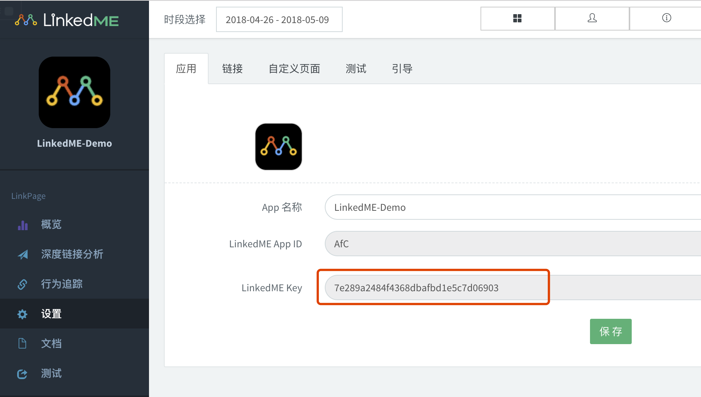

# 准备工作
## 获取LinkedME Key
<font color="red">新用户</font>：在官网网站[注册账号](https://www.linkedme.cc/dashboard/index.html#/access/signup)，注册后[创建应用](https://www.linkedme.cc/dashboard/index.html#/app/aplt/create)，在后台导航栏“设置”中查看LinkedME Key。
<font color="red">老用户</font>：已经在官网网站注册账号，直接[创建应用](https://www.linkedme.cc/dashboard/index.html#/app/aplt/create)（可以创建多个应用），直接到导航栏“设置”中查看LinkedME Key。



## 获取LinkedME Android SDK及Demo
到官方网站下载LinkedME-Android-Deep-Linking-SDK，下载 [Demo工程](https://github.com/WFC-LinkedME/LinkedME-Android-Deep-Linking-Demo)，获取工程libs目录下的 [LinkedME-Android-Deep-Linking-SDK-V1.0.*.jar](https://github.com/WFC-LinkedME/LinkedME-Android-Deep-Linking-Demo/tree/master/LinkedME-Demo/libs)支持包。
# 导入SDK
## 导入LinkedME Android SDK
支持两种方式添加支持库引用：

**方式一：下载jar包并导入**
把下载的LinkedME-Android-Deep-Linking-SDK-V1.0.*.jar文件放到项目libs文件夹下，并添加到项目Module层的build.gradle依赖中,如下所示:
```java
dependencies {
//注意修改jar包名,与下载的jar包名称一致
compile files('libs/LinkedME-Android-Deep-Linking-SDK-V1.0.23.jar')
}
```

**方式二：添加maven仓库引用导入**
* 在工程根节点的build.gradle中添加maven仓库地址，如下所示:

```groovy
buildscript {
    repositories {
        jcenter()
        maven {    
            url 'https://dl.bintray.com/linkedme2016/lkme-deeplinks'
        }
    }
}

allprojects {
    repositories {
        jcenter()
        maven {
            url 'https://dl.bintray.com/linkedme2016/lkme-deeplinks'
        }
    }
}
```

* 在项目Module层的build.gradle中添加依赖，如下所示：

```groovy
dependencies {
    compile fileTree(include: ['*.jar'], dir: 'libs')
    compile "cc.linkedme.deeplinks:link-page:1.0.23"
}
```

# 基本配置
## 配置AndroidManifest.xml
### 添加LinkedME Key
> 提示：配置为application的子节点，而非activity的子节点

```xml
<application
    android:name=".activity.LinkedMEDemoApp">
<!-- LinkedME官网注册应用后,从"设置"页面获取该Key -->
<meta-data
    android:name="linkedme.sdk.key"
    android:value="替换为后台设置页面中的LinkedME Key" />
</application>
```

### 添加访问权限
集成LinkedME SDK需要开启的访问权限，权限说明如下表格所示：

|权限|用途|
|------|--------|
|android.permission.INTERNET|	访问网络|
|android.permission.READ_PHONE_STATE	|获取电话信息，为了获取手机的IMEI号|
|android.permission.ACCESS_NETWORK_STATE	|获取网络状态，是否联网|
|android.permission.ACCESS_WIFI_STATE	|获取WiFi状态|
|android.permission.WRITE_EXTERNAL_STORAGE	|写入外部存储|
|android.permission.BLUETOOTH	|获取设备名称|

添加代码如下：

```xml
<?xml version="1.0" encoding="utf-8"?>
<manifest xmlns:android="http://schemas.android.com/apk/res/android">
<!--LinkedME SDK 需要开启的权限-->
    <uses-permission android:name="android.permission.INTERNET" />
    <uses-permission android:name="android.permission.READ_PHONE_STATE" />
    <uses-permission android:name="android.permission.ACCESS_NETWORK_STATE" />
    <uses-permission android:name="android.permission.ACCESS_WIFI_STATE" />
    <uses-permission android:name="android.permission.WRITE_EXTERNAL_STORAGE" />
    <uses-permission android:name="android.permission.BLUETOOTH" />
</manifest>
```

## 初始化LinkedME实例
在自定义Application类的<font color="red">onCreate()</font>方法中，初始化LinkedME SDK。LinkedME-Android-Deep-Linking-Demo示例代码如下所示：

```java
public class LinkedMEDemoApp extends Application {
@Override
public void onCreate() {
    super.onCreate();
    // 初始化SDK
    LinkedME.getInstance(this);
    
    if (BuildConfig.DEBUG) {
        //设置debug模式下打印LinkedME日志
        LinkedME.getInstance().setDebug();
    }
    //初始时请设置为false
    LinkedME.getInstance().setImmediate(false);
    //设置处理跳转逻辑的中转页，MiddleActivity详见后续配置
    LinkedME.getInstance().setHandleActivity(MiddleActivity.class.getName());
}
}
```
> 提示：注意将自定义Application添加到AndroidManifest中

若应用需要向前兼容到Android 4.0以下版本，请在<font color="red">基类</font>（如：BaseActivity）中添加如下代码以便管理Session：

```java
public class BaseActivity extends AppCompatActivity {

    @Override
    protected void onCreate(@Nullable Bundle savedInstanceState) {
        //兼容14之前的版本需要在基类中添加以下代码
        LinkedME.getInstance().onLMCreated(this);
        super.onCreate(savedInstanceState);
    }
    
    @Override
    protected void onStart() {
        //兼容14之前的版本需要在基类中添加以下代码
        LinkedME.getInstance().onLMStarted(this);
        super.onStart();
    }
    
    @Override
    protected void onResume() {
        //兼容14之前的版本需要在基类中添加以下代码
        LinkedME.getInstance().onLMResumed(this);
        super.onResume();
    }
    
    @Override
    protected void onPause() {
        //兼容14之前的版本需要在基类中添加以下代码
        LinkedME.getInstance().onLMPaused(this);
        super.onPause();
    }
    
    @Override
    public void onStop() {
        //兼容14之前的版本需要在基类中添加以下代码
        LinkedME.getInstance().onLMStoped(this);
        super.onStop();
    }
    
    @Override
    protected void onDestroy() {
        //兼容14之前的版本需要在基类中添加以下代码
        LinkedME.getInstance().onLMDestoryed(this);
        super.onDestroy();
    }
}
```

## 添加深度链接（DeepLink）跳转逻辑
### 创建处理URI Scheme及App Links跳转逻辑的Activity
```java
/**
 * UriSchemeProcessActivity继承AppCompatActivity或者Activity，不继承基类
 */
public class UriSchemeProcessActivity extends AppCompatActivity {

    @Override
    protected void onCreate(@Nullable Bundle savedInstanceState) {
        super.onCreate(savedInstanceState);
        // 唤起自身
        Intent intent = getPackageManager().getLaunchIntentForPackage(getPackageName());
        assert intent != null;
        intent.setFlags(getIntent().getFlags());
        startActivity(intent);
    }

    @Override
    protected void onResume() {
        super.onResume();
        // App打开后无广告展示及登录等条件限制，直接在此处调用以下方法跳转到具体页面，若有条件限制请参考Demo
        if ((getIntent().getFlags() & Intent.FLAG_ACTIVITY_BROUGHT_TO_FRONT) != 0) {
            LinkedME.getInstance().setImmediate(true);
        }
    }

    @Override
    protected void onPause() {
        super.onPause();
        // 防止跳转后一直停留在该页面
        if ((getIntent().getFlags() & Intent.FLAG_ACTIVITY_BROUGHT_TO_FRONT) != 0) {
            finish();
        }
    }

}
```
> 提示：UriSchemeProcessActivity继承AppCompatActivity或者Activity，不继承基类

### 配置URI Scheme及App Links过滤器
添加URI Scheme及App Links过滤器，深度链接才能够通过这两种方式打开APP，在AndroidManifest的UriSchemeProcessActivity声明中添加`android:noHistory="true"`属性及`<intent-filter/>`属性：

* URI Scheme方式；
* App Links方式；

注意事项：
1. 修改android:scheme；请在后台“设置”->“链接”中查看Android下的URI Scheme的值；
2. 修改android:pathPrefix；请在后台“设置”->“概览”中查看LinkedME App ID的值；
LinkedME-Android-Deep-Linking-Demo代码如下所示：


```xml
<application android:name=".activity.LinkedMEDemoApp">
<activity
    android:name=".activity.UriSchemeProcessActivity"
    android:screenOrientation="portrait"
    android:noHistory="true">

    <!-- URI Scheme方式 在dashboard配置中,请保持与ios的URI Scheme相同 -->
    <!--
    如果程序已存在与此完全相同的data配置,即只包含scheme并且值完全相同,
    则需要考虑发起的intent会出现相同应用图标的选择对话框的情况
    参考集成文档:https://www.linkedme.cc/docs/page4.html#link1
    -->
    <intent-filter>
        <!-- 此处scheme值需要替换为后台设置中的scheme值 -->
        <!-- host禁止更改！！！ -->
        <!-- 禁止配置其他属性 -->
        <data android:scheme="修改为LinkedME后台设置的uri scheme"
        android:host="linkedme" />
        <action android:name="android.intent.action.VIEW" />
        <category android:name="android.intent.category.DEFAULT" />
        <category android:name="android.intent.category.BROWSABLE" />
    </intent-filter>
        
    <!-- APP Links方式,Android 23版本及以后支持 -->
    <intent-filter android:autoVerify="true">
        <action android:name="android.intent.action.VIEW" />
        <category android:name="android.intent.category.DEFAULT" />
        <category android:name="android.intent.category.BROWSABLE" />
        <!-- 以下pathPrefix值需要替换为后台设置中 App ID 的值-->
        <!-- host中设置的lkme.cc不要更改！！！-->
        <data
            android:host="lkme.cc"
            android:pathPrefix="/修改为LinkedME后台分配的App ID的值，注意保留反斜杠"
            android:scheme="https" />
        <data
            android:host="lkme.cc"
            android:pathPrefix="/修改为LinkedME后台分配的App ID的值，注意保留反斜杠"
            android:scheme="http" />
    </intent-filter>
</activity>
</application>
```

### 配置应用宝微下载唤起App的处理逻辑
在App首页（也称主页，例如：MainActivity)的onResume()方法中调用LinkedME.getInstance().setImmediate(true)方法，开启跳转功能。示例如下：

```java
@Override
protected void onResume() {
    super.onResume();
    LinkedME.getInstance().setImmediate(true);
}
```
## 解析深度链接参数并跳转
通过深度链接唤起APP时，解析深度链接携带的参数以打开对应页面
新建一个Activity(例如：MiddleActivity)，用于接收SDK回传的参数，并根据业务要求进行跳转
- 首先，创建MiddleActivity，并在AndroidManifest.xml中配置MiddleActivity
 1. 添加属性：`android:noHistory="true"`，目的是不显现该页面也不让其放入栈中，只进行页面逻辑跳转；
LinkedME-Android-Deep-Linking-Demo的MiddleActivity在AndroidManifest.xml中的示例代码如下所示：

```xml
<activity
    android:name=".activity.MiddleActivity"
    android:screenOrientation="portrait"
    android:noHistory="true">
</activity>
```

* 其次，在MiddleActivity的onCreate()方法中编写跳转逻辑
 1. 通过getIntent().getParcelableExtra(LinkedME.LM_LINKPROPERTIES)获取跳转参数
LinkedME-Android-Deep-Linking-Demo的MiddleActivity示例代码如下所示：


```java
public class MiddleActivity extends AppCompatActivity {
// ...
/**
* 解析深度链获取跳转参数，开发者自己实现参数相对应的页面内容
* 通过LinkProperties对象调用getControlParams方法获取自定义参数的HashMap对象,
* 通过创建的自定义key获取相应的值,用于数据处理。
*/
@Override
protected void onCreate(Bundle savedInstanceState) {
    super.onCreate(savedInstanceState);
    if (getIntent() != null) {
        //获取与深度链接相关的值
        LinkProperties linkProperties = getIntent().getParcelableExtra(LinkedME.LM_LINKPROPERTIES);
        if (linkProperties != null) {
            Log.i("LinkedME-Demo", "Channel " + linkProperties.getChannel());
            Log.i("LinkedME-Demo", "control params " + linkProperties.getControlParams());
            Log.i("LinkedME-Demo", "link(深度链接) " + linkProperties.getLMLink());
            Log.i("LinkedME-Demo", "是否为新安装 " + linkProperties.isLMNewUser());
            //获取自定义参数封装成的hashmap对象,参数键值对由集成方定义
            HashMap<String, String> hashMap = linkProperties.getControlParams();
            //根据key获取传入的参数的值,该key关键字View可为任意值,由集成方规定,请与web端商议,一致即可
            String view = hashMap.get("View");
            if (view != null) {
                //根据不同的参数进行页面跳转,detail代表具体跳转到哪个页面,此处语义指详情页
                if (view.equals("detail")) {
                    //DetailActivity类不存在,此处语义指要跳转的详情页,参数也是由上面的HashMap对象指定
                    Intent intent = new ntent(MiddleActivity.this, DetailActivity.class);
                    startActivity(intent);
                }
            }
        }
    }
    finish();
 }
// ...
}
```

# 创建深度链接
> 温馨提示：如果web端集成了js sdk，则无需客户端创建深度链接，本节无需集成。(建议采用js sdk创建深度链接)

通过SDK创建深度链接，例如在分享页面时，页面的链接是通过SDK生成的深度链接，当打开分享内容时就可以通过深度链接唤起APP并进入对应页面。
LinkedME SDK创建深度链接，必须传入链接的参数，用于区分App内不同的页面。比如唯品会商品详情页面的唯一标识为productId=230453452

|参数名称|含义|功能|
|---|---|---|
|Channel|渠道|表示深度链接的渠道，方便统计分析和追踪，例如微信、微博，百度等等；|
|Feature|特点|表示深度链接的特点，例如邀请，分享等等；|
|Tags|标签|表示深度链接的标签特性，自定义任何值；|
|Stage|阶段|表示深度链接的阶段特性，比如第一版产品发布，第二版本测试等等；|
示例代码如下：


```java
public class ShareActivity extends BaseActivity {

    public void share() {
        /**创建深度链接*/
        //web服务器无法创建深度链接时,客户端可选择创建
        //深度链接属性设置
        LinkProperties properties = new LinkProperties();
        //渠道
        properties.setChannel(""); //微信、微博、QQ
        //功能
        properties.setFeature("Share");
        //标签
        properties.addTag("LinkedME");
        properties.addTag("Demo");
        //阶段
        properties.setStage("Live");
        //设置该h5_url目的是为了iOS点击右上角lkme.cc时跳转的地址，一般设置为当前分享页面的地址
        //客户端创建深度链接请设置该字段
        properties.setH5Url("https://linkedme.cc/h5/feature");
        //自定义参数,用于在深度链接跳转后获取该数据
        properties.addControlParameter("LinkedME", "Demo");
        properties.addControlParameter("View", loadUrl);
        LMUniversalObject universalObject = new LMUniversalObject();
        universalObject.setTitle(title);
        // 异步生成深度链接
        universalObject.generateShortUrl(ShareActivity.this, properties, new LMLinkCreateListener() {
            //https://www.lkme.cc/AfC/idFsW02l7
            @Override
            public void onLinkCreate(final String url, LMError error) {
                if (error == null) {
                    Log.i("linkedme", "创建深度链接成功！创建的深度链接为：" + url);
                    //deepLinkUrl创建返回的深度链接
                    final UMImage image = new UMImage(ShareActivity.this, "https://www.linkedme.cc/homepage2.jpg");
                    /**友盟分享化分享，分享的链接不单单是H5链接，而是携带深度链接的H5链接*/
                    new ShareAction(ShareActivity.this).setDisplayList(SHARE_MEDIA.WEIXIN).setShareboardclickCallback(new ShareBoardlistener() {
                        @Override
                        public void onclick(SnsPlatform snsPlatform, SHARE_MEDIA share_media) {
                        if (share_media == SHARE_MEDIA.WEIXIN) {
                            //微信
                            new ShareAction(ShareActivity.this)
                            .setPlatform(share_media)
                            .withText(shareContent)
                            .withTitle("LinkedME" + title)
                            .withMedia(image)
                            //拼接深度链接,客户端将生成的深度链接值拼接到链接后
                            .withTargetUrl(H5_URL + url_path + "?linkedme=" + url)
                            .setCallback(umShareListener)
                            .share();
                            }
                        }
                    }).open();
                }else{
                    Log.i("linkedme", "创建深度链接失败！失败原因：" + error.getMessage());
                }
            }
        });
    }
}
```
> 提示：虽然客户端可自行创建深度链接并分享，但是web端也需要对分享链接进行处理才可使用深度链接，需要将分享链接中的深度链接截取出来，并作为“打开app”按钮的跳转链接(因此，建议使用js sdk创建深度链接)。例如：
原有的分享链接为：https://www.linkedme.cc/h5/partner
追加深度链接的分享链接为：https://www.linkedme.cc/h5/partner?linkedme=https://lkme.cc/AfC/CeG9o5VH8
web端需要将深度链接https://lkme.cc/AfC/CeG9o5VH8取出并作为“打开app”按钮的跳转链接。

# 关于混淆
SDK理论上不需要添加混淆配置，但是如果您发现了我们的SDK给您的程序带来了崩溃异常问题，请及时联系我们，同时添加以下混淆配置，将错误信息发送给我们，方便我们准确定位问题，解决问题。
`-keep class com.microquation.linkedme.android.** { *; }`

# 其他功能
## 测试模式
若想测试集成SDK后是否能正确生成并解析深度链接，可以使用测试模式。测试模式需要先在后台中注册您的测试设备，测试设备产生的数据将进入测试系统（Test）中。

## Android SDK处理逻辑图


## Android DeepLink跳转图示


