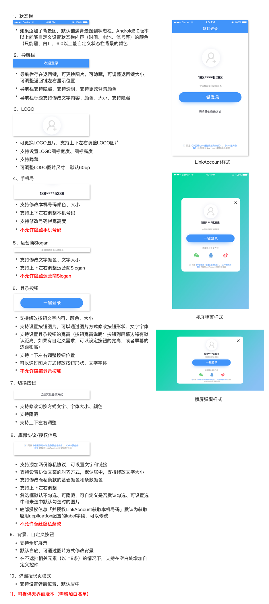

# Android SDK

## 准备工作

#### SDK说明

* 一键登录与号码认证服务需要设备开启蜂窝数据网络，与运营商基站通信;
* 一键登录与号码认证（目前支持中国移动2/3/4G、中国联通3/4G、中国电信4G）目前SDK提供aar包集成；
* 支持网络环境为

  a.纯蜂窝数据网络

  b.蜂窝数据网络与wifi网络双开

* 对于双卡手机，取当前流量卡号；
* SDK支持的最低版本为15；

#### 创建应用

应用的创建流程及APPKEY的获取，请查看「[产品指南](../product-guide/)」文档

## SDK集成

### **SDK导入及配置**

**LinkAccount SDK 获取**

从官网下载aar包，将aar包拷贝至工程的libs目录下。

**配置AndroidManifest.xml**

**配置权限**

```markup
<!--允许应用程序联网，用于访问网关和认证服务器-->
<uses-permission android:name="android.permission.INTERNET"/>
<!--获取imsi用于判断双卡和换卡-->
<uses-permission android:name="android.permission.READ_PHONE_STATE"/>
<!--允许程序访问WiFi网络状态信息-->
<uses-permission android:name="android.permission.ACCESS_WIFI_STATE"/>
<!--获取网络状态，判断是否数据、wifi等-->
<uses-permission android:name="android.permission.ACCESS_NETWORK_STATE"/>
<!--允许程序改变网络连接状态-->
<uses-permission android:name="android.permission.CHANGE_NETWORK_STATE"/>
<!--地理位置信息-->
<uses-permission android:name="android.permission.ACCESS_COARSE_LOCATION"/>
```

| 权限 | 说明 | 使用说明 |
| :--- | :--- | :--- |
| INTERNET | 允许应用程序联网 | 用于访问网关和认证服务器 |
| READ\_PHONE\_STATE | 允许读取手机状态 | 获取imsi用于判断双卡和换卡 |
| ACCESS\_WIFI\_STATE | 允许程序访问WiFi网络状态信息 | 判断当前网络环境 |
| ACCESS\_NETWORK\_STATE | 获取网络状态 | 判断是否数据、wifi等 |
| CHANGE\_NETWORK\_STATE | 允许程序改变网络连接状态 | 当处于wifi，强行切换使用数据网络 |
| ACCESS\_COARSE\_LOCATION | 地理位置信息 | 基站相关 |

**声明Activity**

在AndroidManifest.xml文件中声明必要的Activity

```markup
 <!-- LinkAccount start -->
        <activity
                android:name="cc.lkme.linkaccount.LoginAuthActivity"
                android:configChanges="orientation|keyboardHidden|screenSize"
                android:screenOrientation="portrait"
                android:launchMode="singleTop">
        </activity>
<!-- LinkAccount end -->

<!--中国移动 start-->
        <activity
                android:name="com.cmic.sso.sdk.activity.LoginAuthActivity"
                android:configChanges="orientation|keyboardHidden|screenSize"
                android:screenOrientation="portrait"
                android:launchMode="singleTop">
        </activity>
<!--中国移动 end-->
```

**混淆规则**

```text
 # 联通取号、认证混淆
 -dontwarn com.unicom.xiaowo.login.**
 -keep class com.unicom.xiaowo.login.**{*;}

# 移动混淆
 -dontwarn com.cmic.sso.sdk.**
 -keep class com.cmic.sso.sdk.**{*;}

# 电信混淆
 -dontwarn cn.com.chinatelecom.account.**
 -keep class cn.com.chinatelecom.account.**{*;}

# LinkAccount
 -dontwarn cc.lkme.linkaccount.**
 -keep class cc.lkme.linkaccount.**{*;}
```

### **SDK 初始化**

**接口**

```java
/**
 * 初始化LinkAccount SDK
 *
 * @param context  Application Context
 * @param key      linkaccount key
 * @return LinkAccount 实例
 */
public static LinkAccount getInstance(@NonNull Context context, @NonNull String key)
/**
 * 是否打印相关认证日志
 *
 * @param isDebug true: 打印 false: 不打印
 */
public void setDebug(boolean isDebug)
```

**说明**

* 在Application的onCreate\(\)中初始化;
* 只需初始化一次，多次调用不会多次初始化，与一次调用效果一致；

**参数描述**

| 参数 | 是否必填 | 类型 | 说明 |
| :--- | :--- | ---: | ---: |
| context | 是 | Context | Application Context |
| key | 是 | String | 后台分配的应用APPkey |

**示例代码**

```java
// 初始化
public class CustomApplication extends Application {

    @Override
    public void onCreate() {
        super.onCreate();
        LinkAccount.getInstance(getApplicationContext(), "LinkAccount Key");
        // 设置debug模式来输出日志
        if (BuildConfig.DEBUG) {
            LinkAccount.getInstance().setDebug(true);
        }
    }
}
```

**添加结果监听**

```java
/**
 * 设置结果监听
 *
 * @param listener TokenResultListener 结果监听
 */
public void setTokenResultListener(TokenResultListener listener)

/**
 * 预取号、一键登录、号码认证结果回调监听接口
 */
public interface TokenResultListener {
    /**
     * 获取成功，返回token
     *
     * @param resultType   结果类型 0: 预取号结果 1: 一键登录结果 2: 号码认证结果
     * @param tokenResult  成功结果对象TokenResult
     * @param originResult 运营商返回的原始数据
     */
    void onSuccess(int resultType, TokenResult tokenResult, String originResult);

    /**
     * 失败，返回失败的结果，json串格式
     *
     * @param resultType 错误类型
     * @param result     错误说明
     */
    void onFailed(int resultType, String result);
}
```

**说明**

* 在需要监听结果的Activity中设置监听；
* 用于预取号、一键登录、号码认证结果回调监听；
* 根据返回的不同的结果类型需要分别处理。

**参数描述**

成功回调

| 参数 | 类型 | 说明 |
| :--- | :--- | :--- |
| resultType | int | 结果类型 0: 预取号结果 1: 一键登录结果 2: 号码认证结果 |
| tokenResult | TokenResult | 成功结果对象TokenResult |
| originResult | String | 运营商返回的原始数据 |

TokenResult说明

```java
public class TokenResult {
    // 成功状态码
    private int resultCode;
    // 一键登录或号码认证 token，移动、联通、电信均返回
    private String accessToken;
    // CM: 中国移动 CU: 中国联通 CT: 中国电信 XX: 未知
    private String operatorType;
    // 一键登录或号码认证 auth，电信返回
    private String gwAuth;
    // 系统标识，0：iOS 1: Android
    private String platform;
}
```

失败回调

| 参数 | 类型 | 说明 |
| :--- | :--- | :--- |
| resultType | int | 结果类型 0: 预取号结果 1: 一键登录结果 2: 号码认证结果 |
| result | String | 错误描述，参见文档后面错误码描述 |

**示例代码**

```java
LinkAccount.getInstance().setTokenResultListener(new TokenResultListener() {
    @Override
    public void onSuccess(@AbilityType final int resultType, final TokenResult tokenResult, final String originResult) {
        runOnUiThread(new Runnable() {
            @Override
            public void run() {
                switch (resultType) {
                    case AbilityType.ABILITY_ACCESS_CODE:
                         break;
                    case AbilityType.ABILITY_TOKEN:
                         LinkAccount.getInstance().quitAuthActivity();
                         String token = tokenResult.getAccessToken();
                         String authCode = tokenResult.getGwAuth();
                         String platform = tokenResult.getPlatform();
                         String operator = getChannel(tokenResult.getOperatorType());
                         break;
                    case AbilityType.ABILITY_MOBILE_TOKEN:
                         break;
                  }
            }
        });
    }

     @Override
     public void onFailed(int resultType, final String info) {
         runOnUiThread(new Runnable() {
             @Override
             public void run() {
                 Toast.makeText(MainActivity.this, info, ToaNGTH_SHORT).show();
             }
         });

     }
 });
```

### **预取号**

**接口**

```java
/**
* 预取号，必须先调用该方法，才可调用一键登录与号码认证方法
* 移动手机号必须申请电话权限，否则无法预取号成功
*
* @param timeout 预取号超时时间，2000-8000ms
*/
public void preLogin(int timeout)
```

**说明**

* 移动手机号必须有电话权限，否则无法预取号及后续操作，建议提前获取电话权限；
* 预取号是一键登录与号码认证调用的前提条件；
* 回调结果在初始化SDK中的TokenResultListener中监听；
* 调用该方法后，不建议立即调用一键登录方法；

**使用场景**

* 初始化SDK后，当用户有意向注册或登录时调用预登录接口，可加快一键登录授权页面的调起速度；

**参数描述**

| 参数 | 类型 | 说明 |
| :--- | :--- | :--- |
| timeout | int | 请求超时时间（毫秒），可设置2000-8000毫秒 |

**示例代码**

```java
 // 预取号
 LinkAccount.getInstance().preLogin(5000);
```

### **一键登录（拉起授权页面）**

**接口**

```java
/**
 * 一键登录，获取一键登录的token，然后回传自己服务器置换手机号
 *
 * @param timeout 超时时间，2000-8000ms
 */
public void getLoginToken(int timeout)
```

**说明**

* 调用前必须首先调用预取号接口；
* 回调结果在初始化SDK中的TokenResultListener中监听。

**使用场景**

* 调用一键登录方法，SDK将会拉起授权页面，用户授权后，SDK将返回用于置换手机号的 token 给到应用客户端，客户端将该 token （电信同时需要gwAuth）传给自己的应用服务器，用来置换手机号。

**参数描述**

| 参数 | 类型 | 说明 |
| :--- | :--- | :--- |
| timeout | int | 请求超时时间（毫秒），可设置2000-8000毫秒 |

**示例代码**

```java
// 一键登录
LinkAccount.getInstance().getLoginToken(5000);
```

### **号码认证**

**接口**

```java
/**
 * 号码认证，认证用户填写的手机号是否是本机号码
 *
 * @param timeout 预取号超时时间，2000-8000ms
 */
public void getMobileCode(int timeout)
```

**说明**

* 调用前必须首先调用预取号接口；
* 回调结果在初始化SDK中的TokenResultListener中监听。

**使用场景**

* 调用号码认证方法，SDK将返回用于手机号认证的 token 给到应用客户端，客户端将该 token 及用户填写的手机号传给自己的应用服务器，用来验证填写的号码是否是本机号码。

**参数描述**

| 参数 | 类型 | 说明 |
| :--- | :--- | :--- |
| timeout | int | 请求超时时间（毫秒），可设置2000-8000毫秒 |

**示例代码**

```java
// 号码认证
LinkAccount.getInstance().getMobileCode(5000);
```

### **使用默认认证页面**

**接口**

```java
/**
* 设置是否使用默认认证页面 只针对白名单用户生效，非白名单用户默认为true
*
* @param useDefault true：使用 false：不使用
*/
public void useDefaultAuthActivity(boolean useDefault) 
```

**参数描述**

| 参数 | 类型 | 说明 |
| :--- | :--- | :--- |
| useDefault | boolean | 设置是否使用默认认证页面 只针对白名单用户生效，非白名单用户默认为true
 |


**示例代码**

```java
// 使用默认认证页面
LinkAccount.getInstance().useDefaultAuthActivity(true);
```

### **手动关闭授权页面**

**接口**

```java
/**
 * 关闭授权页面
 */
public void quitAuthActivity()
```

**说明**

* 手动关闭一键登录页面

**示例代码**

```java
// 关闭授权页面
LinkAccount.getInstance().quitAuthActivity();
```

### **打印日志**

**接口**

```java
/**
 * 是否打印相关认证日志
 *
 * @param isDebug true: 打印 false: 不打印
 */
public void setDebug(boolean isDebug)
```

**参数描述**

| 参数 | 类型 | 说明 |
| :--- | :--- | :--- |
| isDebug | boolean | 是否打印相关日志 |

**示例代码**

```java
// 打印日志
LinkAccount.getInstance().setDebug(true);
```

## **一键登录授权页面修改**



**接口**

```java
/**
 * 一键登录授权页面配置
 *
 * @param authUIConfig 布局配置
 */
public void setAuthUIConfig(AuthUIConfig authUIConfig)
```

```java
/**
 * 设置 status bar 的背景色
 */
public Builder setStatusBarColor(int statusBarColor)

/**
 * 设置 status bar 样式，true：暗色图标 false：亮色图标
 */
public Builder setStatusBarLight(boolean statusBarLight)

/**
 * 设置导航栏背景色
 */
public Builder setNavColor(int navColor)

/**
 * 设置导航栏标题内容
 */
public Builder setNavText(String navText)

/**
 * 设置导航栏标题字体大小
 */
public Builder setNavTextSize(int navTextSize)

/**
 * 设置导航栏标题颜色
 */
public Builder setNavTextColor(int navTextColor)

/**
 * 设置返回按钮图片
 */
public Builder setNavBackImgPath(String navBackImgPath)

/**
 * 设置返回按钮图片
 */
public Builder setNavBackImgDrawable(Drawable navBackImgDrawable)

/**
 * 设置返回按钮是否隐藏
 */
public Builder setNavBackHidden(boolean navBackHidden)

/**
 * 设置返回按钮相对于屏幕位置
 *
 * @param navBackOffsetX       相对于屏幕左侧X偏移
 * @param navBackOffsetY       相对于屏幕顶部Y偏移
 * @param navBackOffsetRightX  相对于屏幕右侧X偏移
 * @param navBackOffsetBottomY 相对于屏幕底部Y偏移
 */
public Builder setNavBackOffset(Integer navBackOffsetX, Integer navBackOffsetY, Integer navBackOffsetRightX, Integer navBackOffsetBottomY) 

/**
 * 设置返回按钮的宽度
 */
public Builder setNavBackWidh(int navBackWidh)

/**
 * 设置返回按钮的高度
 */
public Builder setNavBackHeight(int navBackHeight)

/**
 * 设置导航栏是否隐藏
 */
public Builder setNavHidden(boolean navHidden)

/**
 * 设置导航栏是否透明
 */
public Builder setNavTransparent(boolean navTransparent)

/**
 * 设置背景图片
 */
public Builder setBackgroundImgPath(String backgroundImgPath)

/**
 * 设置背景图片
 */
public Builder setBackgroundImgDrawable(Drawable backgroundImgDrawable)

/**
 * 设置背景颜色，默认白色
 */
public Builder setBackgroundColor(int backgroundColor)

/**
 * 设置logo图片
 */
public Builder setLogoImgPath(String logoImgPath)

/**
 * 设置logo图片
 */
public Builder setLogoImgDrawable(Drawable logoImgDrawable)

/**
 * 设置是否隐藏logo
 */
public Builder setLogoHidden(boolean logoHidden)

/**
 * 设置logo padding top
 */
public Builder setLogoPaddingTop(int logoPaddingTop)

/**
 * 设置logo padding bottom
 */
public Builder setLogoPaddingBottom(int logoPaddingBottom)

/**
 * 设置logo图标宽度
 */
public Builder setLogoWidth(int logoWidth)

/**
 * 设置logo图标高度
 */
public Builder setLogoHeight(int logoHeight)

/**
 * 设置logo相对于屏幕位置
 *
 * @param logoOffsetX       相对于屏幕左侧X偏移
 * @param logoOffsetY       相对于屏幕顶部Y偏移
 * @param logoOffsetRightX  相对于屏幕右侧X偏移
 * @param logoOffsetBottomY 相对于屏幕底部Y偏移
 */
public Builder setLogoOffset(Integer logoOffsetX, Integer logoOffsetY, Integer logoOffsetRightX, Integer logoOffsetBottomY) 

/**
 * 设置脱敏号码颜色
 */
public Builder setNumberColor(int numberColor)

/**
 * 设置脱敏号码大小
 */
public Builder setNumberTextSize(int numberTextSize)

/**
 * 设置号码栏的宽度
 */
public Builder setNumberWidth(int numberWidth)

/**
 * 设置号码栏的高度
 */
public Builder setNumberHeight(int numberHeight)

/**
 * 设置手机号相对于屏幕位置
 *
 * @param numberOffsetX       相对于屏幕左侧X偏移
 * @param numberOffsetY       相对于屏幕顶部Y偏移
 * @param numberOffsetRightX  相对于屏幕右侧X偏移
 * @param numberOffsetBottomY 相对于屏幕底部Y偏移
 */
public Builder setNumberOffset(Integer numberOffsetX, Integer numberOffsetY, Integer numberOffsetRightX, Integer numberOffsetBottomY)

/**
 * 设置slogan字体颜色
 */
public Builder setSloganTextColor(int sloganTextColor)

/**
 * 设置slogan字体大小
 */
public Builder setSloganTextSize(int sloganTextSize)

/**
 * 设置slogan相对于屏幕位置
 *
 * @param sloganOffsetX       相对于屏幕左侧X偏移
 * @param sloganOffsetY       相对于屏幕顶部Y偏移
 * @param sloganOffsetRightX  相对于屏幕右侧X偏移
 * @param sloganOffsetBottomY 相对于屏幕底部Y偏移
 */
public Builder setSloganOffset(Integer sloganOffsetX, Integer sloganOffsetY, Integer sloganOffsetRightX, Integer sloganOffsetBottomY)

/**
 * 设置登录按钮文字
 */
public Builder setLogBtnText(String logBtnText)

/**
 * 设置登录按钮字体颜色
 */
public Builder setLogBtnTextColor(int logBtnTextColor)

/**
 * 设置登录按钮字体大小
 */
public Builder setLogBtnTextSize(int logBtnTextSize)

/**
 * 设置登录按钮宽度
 */
public Builder setLogBtnWidth(int logBtnWidth)

/**
 * 设置登录按钮高度
 */
public Builder setLogBtnHeight(int logBtnHeight)

/**
 * 设置登录按钮背景图片
 */
public Builder setLogBtnBackgroundPath(String logBtnBackgroundPath)

/**
 * 设置登录按钮背景图片
 */
public Builder setLogBtnBackgroundDrawable(Drawable logBtnBackgroundDrawable)

/**
 * 设置登录按钮相对于屏幕位置
 *
 * @param logBtnOffsetX       相对于屏幕左侧X偏移
 * @param logBtnOffsetY       相对于屏幕顶部Y偏移
 * @param logBtnOffsetRightX  相对于屏幕右侧X偏移
 * @param logBtnOffsetBottomY 相对于屏幕底部Y偏移
 */
public Builder setLogBtnOffset(Integer logBtnOffsetX, Integer logBtnOffsetY, Integer logBtnOffsetRightX, Integer logBtnOffsetBottomY)

/**
 * 设置隐私条款1的文字和链接
 */
public Builder setAppPrivacyOne(String name, String url)

/**
 * 设置隐私条款2的文字和链接
 */
public Builder setAppPrivacyTwo(String name, String url)

/**
 * 设置隐私条款基础颜色和条款颜色
 */
public Builder setAppPrivacyColor(int baseColor, int privacyColor)

/**
 * 设置隐私条款按钮相对于屏幕位置
 *
 * @param privacyOffsetX       相对于屏幕左侧X偏移
 * @param privacyOffsetY       相对于屏幕顶部Y偏移
 * @param privacyOffsetRightX  相对于屏幕右侧X偏移
 * @param privacyOffsetBottomY 相对于屏幕底部Y偏移
 */
public Builder setPrivacyOffset(Integer privacyOffsetX, Integer privacyOffsetY, Integer privacyOffsetRightX, Integer privacyOffsetBottomY) 

/**
 * 设置复选按钮是否隐藏
 */
public Builder setCheckboxHidden(boolean checkboxHidden)

/**
 * 设置复选按钮是否默认为选中状态
 */
public Builder setCheckboxChecked(boolean checkboxChecked)

/**
 * 设置隐私条款是否左对齐，默认居中对齐
 */
public Builder setPrivacyGravityLeft(boolean privacyGravityLeft)

/**
 * 设置隐私条款文字大小
 */
public Builder setPrivacyTextSize(int privacyTextSize)

public Builder setPrivacyDecorator(String firstDecorator, String secondDecorator, String thirdDecorator, String fourthDecorator)

/**
 * 设置切换方式视图是否可见
 */
public Builder setSwitchHidden(boolean switchHidden)

/**
 * 设置切换方式文字
 */
public Builder setSwitchText(String switchText)

/**
 * 设置切换方式视图字体颜色
 */
public Builder setSwitchTextColor(int switchTextColor)

/**
 * 设置切换文字大小
 */
public Builder setSwitchTextSize(int switchTextSize)

/**
 * 设置切换方式视图的点击事件
 */
public Builder setSwitchClicker(View.OnClickListener switchClicker)

/**
 * 设置复选框样式
 */
public Builder setCheckboxDrawable(String checkboxDrawable)

/**
* 设置切换方式按钮相对于屏幕位置
*
* @param switchOffsetX 相对于屏幕左侧X偏移
* @param switchOffsetY 相对于屏幕顶部Y偏移
* @param switchOffsetRightX 相对于屏幕右侧X偏移
* @param switchOffsetBottomY 相对于屏幕底部Y偏移
*/
public Builder setSwitchOffset(Integer switchOffsetX, Integer switchOffsetY, Integer switchOffsetRightX, Integer switchOffsetBottomY) 

/**
 * 设置是否以Dialog方式显示
 */
public Builder setShowDialog(boolean isDialog) 

/**
 * 设置Dialog大小
 */
public Builder setDialogSize(Integer dialogWidth, Integer dialogHeight)

/**
 * 设置Dialog透明度
 */
public Builder setDialogDimAmount(float dialogDimAmount) 

/**
 * 设置Dialog相对位置
 */
public Builder setDialogGravity(int dialogGravity) 

/**
 * 设置Dialog偏移量
 */
public Builder setDialogOffset(Integer dialogOffsetX, Integer dialogOffsetY)

/**
 * 添加自定义视图
 */
public Builder addCustomView(View view, View.OnClickListener onClickListener)

/**
 * 自定义正在加载的视图
 */
public Builder setLoadingView(View loadingView)
```

**参数描述**

| 参数 | 类型 | 说明 |
| :--- | :--- | :--- |
| authUIConfig | AuthUIConfig | 一键登录授权页面配置 |

**说明**

* 配置一键登录授权页面需要在调用一键登录方法之前调用才可生效；

**示例代码**

```java
AuthUIConfig.Builder builder = new AuthUIConfig.Builder();
builder.setNavText("欢迎登录");
builder.setCheckboxDrawable("linkaccount_check");
LinkAccount.getInstance().setAuthUIConfig(builder.create());
```

## **返回码对照**

| 返回码 | 说明 |
| :--- | :--- |
| 6666 | 成功 |
| 10000 | 未知错误 |
| 10001 | SDK未初始化 |
| 10002 | 未检测到网络访问权限 |
| 10003 | 初始化失败 |
| 10004 | LinkedAccount Key无效 |
| 10005 | 预取号失败 |
| 10006 | Token获取失败 |
| 10007 | 号码认证Token获取失败 |
| 10008 | 监听未初始化 |
| 10009 | json格式化数据异常 |
| 10010 | 用户取消 |
| 10011 | 请先调用预取号接口 |
| 10012 | 一键登录切换到其他方式 |
| 10013 | 未找到相应方法 |
| 10014 | 用户未授权READ\_PHONE\_STATE |

## 常见问题

**某些厂商机增加了移动数据网络权限设置问题**

由于某些手机操作系统增加了应用的数据网络权限，在手机wifi和数据网络同时打开时，应用首次打开默认使用wifi数据通道，此时应用的数据网络权限是关闭的，最终导致一键登录失败。

解决方法：用户须在纯移动数据网络环境打开应用，用户授权应用使用移动数据网络权限后SDK才能正常使用

**号码认证支持的移动网络情况**

中国移动支持2G/3G/4G、中国联通支持3G/4G、中国电信支持4G，但2G网络下认证失败率稍高。

