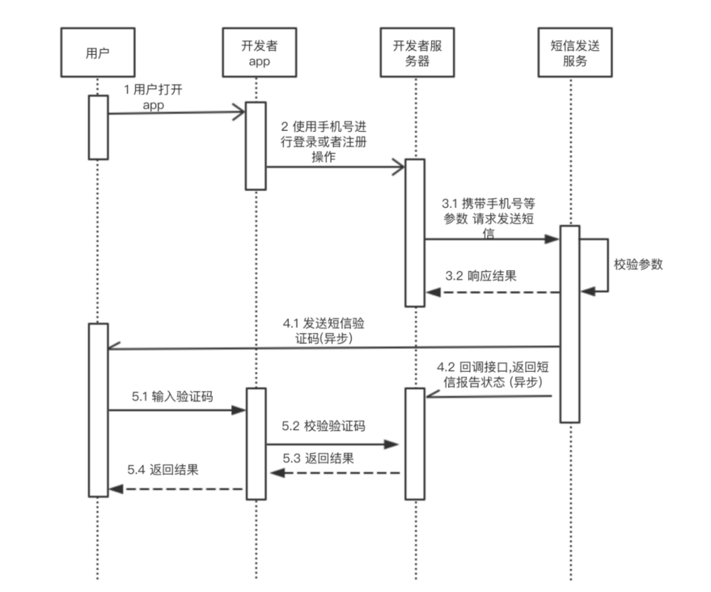
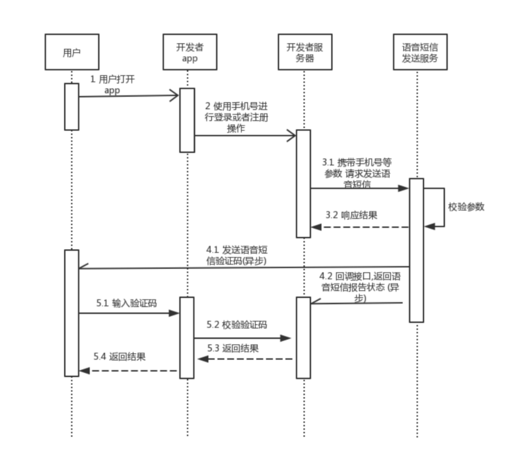

# 服务端接口

## 移动认证服务端接口

### 获取用户登录手机号码的接口

#### 简要描述

* 获取用户登录手机号码的接口

#### 请求URL

* [https://account.linkedme.cc/phone/info](https://account.linkedme.cc/phone/info)

#### 请求方式

* POST+json,Content-type设置为application/json 

#### 请求参数

<table>
  <thead>
    <tr>
      <th style="text-align:left">&#x53C2;&#x6570;&#x540D;</th>
      <th style="text-align:left">&#x5FC5;&#x9009;</th>
      <th style="text-align:left">&#x7C7B;&#x578B;</th>
      <th style="text-align:left">&#x8BF4;&#x660E;</th>
    </tr>
  </thead>
  <tbody>
    <tr>
      <td style="text-align:left">channel</td>
      <td style="text-align:left">&#x662F;</td>
      <td style="text-align:left">string</td>
      <td style="text-align:left">&#x8FD0;&#x8425;&#x5546;&#x7C7B;&#x578B;&#xFF1A; &#xFF08;0&#xFF1A;&#x79FB;&#x52A8;&#xFF09;&#xFF0C;&#xFF08;1&#xFF1A;&#x7535;&#x4FE1;&#xFF09;&#xFF0C;&#xFF08;2&#xFF1A;&#x8054;&#x901A;&#xFF09;</td>
    </tr>
    <tr>
      <td style="text-align:left">platform</td>
      <td style="text-align:left">&#x662F;</td>
      <td style="text-align:left">string</td>
      <td style="text-align:left">&#x5E73;&#x53F0;&#x7F16;&#x53F7;&#xFF1A; IOS (0, &quot;ios&quot;), ANDROID
        (1, &quot;android&quot;)</td>
    </tr>
    <tr>
      <td style="text-align:left">app_key</td>
      <td style="text-align:left">&#x662F;</td>
      <td style="text-align:left">string</td>
      <td style="text-align:left">&#x5E94;&#x7528;APPKEY</td>
    </tr>
    <tr>
      <td style="text-align:left">auth_code</td>
      <td style="text-align:left">&#x5426;</td>
      <td style="text-align:left">string</td>
      <td style="text-align:left">&#x6821;&#x9A8C;&#x7801;&#xFF0C;&#x5F53;&#x8FD0;&#x8425;&#x5546;&#x7C7B;&#x578B;&#x4E3A;1&#x65F6;&#xFF0C;&#x5FC5;&#x586B;</td>
    </tr>
    <tr>
      <td style="text-align:left">token</td>
      <td style="text-align:left">&#x662F;</td>
      <td style="text-align:left">string</td>
      <td style="text-align:left">&#x8EAB;&#x4EFD;&#x6807;&#x8BC6;&#xFF0C;&#x83B7;&#x53D6;&#x7528;&#x6237;&#x4FE1;&#x606F;</td>
    </tr>
    <tr>
      <td style="text-align:left">sign</td>
      <td style="text-align:left">&#x662F;</td>
      <td style="text-align:left">string</td>
      <td style="text-align:left">
        <p>&#x9664;sign &#x5916;&#x5176;&#x5B83;&#x53C2;&#x6570;&#x7684; RSA &#x52A0;&#x5BC6;&#x503C;&#xFF0C;
          &#x52A0;&#x5BC6;&#x7B97;&#x6CD5;&#x5982;&#x4E0B;:</p>
        <p>sign=RSA(app_key+auth_code+channel+platform+token,RSA_Private_key) &#x8F6C;16&#x8FDB;&#x5236;&#x3002;</p>
        <p>&#x7B7E;&#x540D;&#x7B97;&#x6CD5;&#x4E3A;&#xFF1A;SHA256withRSA&#x3002;</p>
        <p>&#x9700;&#x8981;&#x6CE8;&#x610F;&#x53C2;&#x6570;&#x62FC;&#x63A5; key&#x5347;&#x5E8F;&#x6392;&#x5E8F;&#xFF0C;&#x5BC6;&#x94A5;&#x683C;&#x5F0F;&#x4E3A;PSKCS#8&#xFF0C;1024&#x4F4D;&#xFF08;bit&#xFF09;&#x3002;</p>
        <p>&#x5176;&#x4E2D; RSA_Private_key&#x662F;&#x5408;&#x4F5C;&#x65B9;&#x7684;
          RSA &#x79C1;&#x94A5;&#xFF0C;&#x5408;&#x4F5C;&#x65B9;&#x9700;&#x8981;&#x5411;&#x5F00;&#x653E;&#x5E73;&#x53F0;&#x63D0;&#x4F9B;
          RSA &#x516C;&#x94A5;&#xFF0C;&#x7528;&#x4E8E;&#x8BBF;&#x95EE;&#x63A5;&#x53E3;&#x65F6;&#x7684;&#x9A8C;&#x7B7E;</p>
      </td>
    </tr>
  </tbody>
</table>**请求示例**

```text
{
    "header": {
        "Content-type": application/json,
    },
    "body": {
       "channel":"1",
       "platform":"0",
       "app_key":"99bfd12b542b36ad35ea378a07edf349",
       "auth_code":"1234",
       "token":"nm899e6f8f32b44f81972cbe28ca01623a",
       "sign":"4B36329C1429512FD24C2C460065F677D3521EC56A91370AFF40E65990AF74C7D12C9F0E6061D2E2C6FE022B66CCD23554249ECA13D5F8FB0E8C7459DD6D25A0309FD6AE73D4918E45EAF85AB7D4DA942B3664966B92CEFC57B7B28CC4EE57186A1B27860FF74698FE6307A85F0DD9D3A13A34397CB8F4F921DC3869BAA9B80"
    }
}
```

#### 返回参数

<table>
  <thead>
    <tr>
      <th style="text-align:left">&#x53C2;&#x6570;&#x540D;</th>
      <th style="text-align:left">&#x5FC5;&#x9009;</th>
      <th style="text-align:left">&#x7C7B;&#x578B;</th>
      <th style="text-align:left">&#x8BF4;&#x660E;</th>
    </tr>
  </thead>
  <tbody>
    <tr>
      <td style="text-align:left">code</td>
      <td style="text-align:left">&#x662F;</td>
      <td style="text-align:left">int</td>
      <td style="text-align:left">&#x8FD4;&#x56DE;&#x72B6;&#x6001;&#x7801;</td>
    </tr>
    <tr>
      <td style="text-align:left">msg</td>
      <td style="text-align:left">&#x662F;</td>
      <td style="text-align:left">string</td>
      <td style="text-align:left">&#x8FD4;&#x56DE;&#x72B6;&#x6001;&#x7801;&#x63CF;&#x8FF0;&#x4FE1;&#x606F;</td>
    </tr>
    <tr>
      <td style="text-align:left">time</td>
      <td style="text-align:left">&#x662F;</td>
      <td style="text-align:left">long</td>
      <td style="text-align:left">&#x8BF7;&#x6C42;&#x6D88;&#x606F;&#x53D1;&#x9001;&#x7684;&#x7CFB;&#x7EDF;&#x65F6;&#x95F4;&#x7684;&#x6BEB;&#x79D2;&#x503C;</td>
    </tr>
    <tr>
      <td style="text-align:left">body</td>
      <td style="text-align:left">&#x662F;</td>
      <td style="text-align:left">string</td>
      <td style="text-align:left">
        <p>&#x8FD4;&#x56DE;&#x4F53;&#xFF0C;&#x8868;&#x793A;&#x624B;&#x673A;&#x53F7;&#x7801;&#xFF0C;&#x52A0;&#x5BC6;&#x65B9;&#x5F0F;&#x4E3A;RSA&#xFF0C;</p>
        <p>&#x5F00;&#x53D1;&#x8005;&#x4F7F;&#x7528;&#x5728;&#x793E;&#x533A;&#x914D;&#x7F6E;&#x7684;&#x52A0;&#x5BC6;&#x516C;&#x94A5;&#x5BF9;&#x5E94;&#x7684;&#x79C1;&#x94A5;&#x8FDB;&#x884C;&#x89E3;&#x5BC6;&#xFF0C;</p>
        <p>&#x5BC6;&#x94A5;&#x683C;&#x5F0F;&#x4E3A;PSKCS#8&#xFF0C;&#x751F;&#x6210;&#x5BC6;&#x94A5;&#x4F4D;&#x6570;&#x4E3A;1024&#x4F4D;&#xFF08;bit&#xFF09;&#xFF0C;body&#x4E3A;16&#x8FDB;&#x5236;&#x5B57;&#x7B26;&#x4E32;&#x3002;</p>
      </td>
    </tr>
  </tbody>
</table>#### 

#### 返回示例

```text
{
      "header": {
        "code": 200,
        "msg": "操作成功",
        "time": 1561690611021
                 },
      "body": "4B36329C1429512FD24C2C460065F677D3521EC56A91370AFF40E65990AF74C7D12C9F0E6061D2E2C6FE022B66CCD23554249ECA13D5F8FB0E8C7459DD6D25A0309FD6AE73D4918E45EAF85AB7D4DA942B3664966B92CEFC57B7B28CC4EE57186A1B27860FF74698FE6307A85F0DD9D3A13A34397CB8F4F921DC3869BAA9B80"
}
```

#### 时序图


### 校验用户登录号码接口

#### 简要描述

* 校验用户登录号码接口

#### 请求URL

* [https://account.linkedme.cc/phone/verify](https://account.linkedme.cc/phone/verify)

#### 请求方式

* POST+json,Content-type设置为application/json 

#### 请求参数

<table>
  <thead>
    <tr>
      <th style="text-align:left">&#x53C2;&#x6570;&#x540D;</th>
      <th style="text-align:left">&#x5FC5;&#x9009;</th>
      <th style="text-align:left">&#x7C7B;&#x578B;</th>
      <th style="text-align:left">&#x8BF4;&#x660E;</th>
    </tr>
  </thead>
  <tbody>
    <tr>
      <td style="text-align:left">channel</td>
      <td style="text-align:left">&#x662F;</td>
      <td style="text-align:left">string</td>
      <td style="text-align:left">&#x8FD0;&#x8425;&#x5546;&#x7C7B;&#x578B;&#xFF1A; &#xFF08;0&#xFF1A;&#x79FB;&#x52A8;&#xFF09;&#xFF0C;&#xFF08;1&#xFF1A;&#x7535;&#x4FE1;&#xFF09;&#xFF0C;&#xFF08;2&#xFF1A;&#x8054;&#x901A;&#xFF09;</td>
    </tr>
    <tr>
      <td style="text-align:left">platform</td>
      <td style="text-align:left">&#x662F;</td>
      <td style="text-align:left">string</td>
      <td style="text-align:left">&#x5E73;&#x53F0; IOS (0, &quot;ios&quot;), ANDROID (1, &quot;android&quot;)</td>
    </tr>
    <tr>
      <td style="text-align:left">app_key</td>
      <td style="text-align:left">&#x662F;</td>
      <td style="text-align:left">string</td>
      <td style="text-align:left">&#x5E94;&#x7528;APPKEY</td>
    </tr>
    <tr>
      <td style="text-align:left">token</td>
      <td style="text-align:left">&#x662F;</td>
      <td style="text-align:left">string</td>
      <td style="text-align:left">&#x8EAB;&#x4EFD;&#x6807;&#x8BC6;&#xFF0C;&#x83B7;&#x53D6;&#x7528;&#x6237;&#x4FE1;&#x606F;</td>
    </tr>
    <tr>
      <td style="text-align:left">phone_num</td>
      <td style="text-align:left">&#x662F;</td>
      <td style="text-align:left">string</td>
      <td style="text-align:left">&#x624B;&#x673A;&#x53F7;</td>
    </tr>
    <tr>
      <td style="text-align:left">sign</td>
      <td style="text-align:left">&#x662F;</td>
      <td style="text-align:left">string</td>
      <td style="text-align:left">
        <p>&#x9664; sign &#x5916;&#x5176;&#x5B83;&#x53C2;&#x6570;&#x7684; RSA &#x52A0;&#x5BC6;&#x503C;&#xFF0C;&#x52A0;&#x5BC6;&#x7B97;&#x6CD5;&#x5982;&#x4E0B;:</p>
        <p>sign=RSA(app_key+channel+phone_num+platform+token,RSA_Private_key)&#x8F6C;16&#x8FDB;&#x5236;&#x3002;</p>
        <p>&#x7B7E;&#x540D;&#x7B97;&#x6CD5;&#x4E3A;&#xFF1A;SHA256withRSA, 1024&#x4F4D;&#xFF08;bit&#xFF09;&#x3002;</p>
        <p>&#x9700;&#x8981;&#x6CE8;&#x610F;&#x53C2;&#x6570;&#x62FC;&#x63A5; key &#x5347;&#x5E8F;&#x6392;&#x5E8F;,&#x5BC6;&#x94A5;&#x683C;&#x5F0F;&#x4E3A;PSKCS#8&#x3002;</p>
        <p>&#x5176;&#x4E2D; RSA_Private_key &#x662F;&#x5408;&#x4F5C;&#x65B9;&#x7684;
          RSA &#x79C1;&#x94A5;&#xFF0C;&#x5408;&#x4F5C;&#x65B9;&#x9700;&#x8981;&#x5411;&#x5F00;&#x653E;&#x5E73;&#x53F0;&#x63D0;&#x4F9B;RSA&#x516C;&#x94A5;&#xFF0C;&#x7528;&#x4E8E;&#x8BBF;&#x95EE;&#x63A5;&#x53E3;&#x65F6;&#x7684;&#x9A8C;&#x7B7E;</p>
      </td>
    </tr>
  </tbody>
</table>#### 请求示例

```text
{
    "header": {
        "Content-type": application/json,
    },
    "body": {
       "channel":"1",
       "platform":"0",
       "app_key":"99bfd12b542b36ad35ea378a07edf349",
       "token":"nm899e6f8f32b44f81972cbe28ca01623a",
       "phone_num":"18123972798",                                        
       "sign":"4B36329C1429512FD24C2C460065F677D3521EC56A91370AFF40E65990AF74C7D12C9F0E6061D2E2C6FE022B66CCD23554249ECA13D5F8FB0E8C7459DD6D25A0309FD6AE73D4918E45EAF85AB7D4DA942B3664966B92CEFC57B7B28CC4EE57186A1B27860FF74698FE6307A85F0DD9D3A13A34397CB8F4F921DC3869BAA9B80"
    }
}
```

#### 返回参数

<table>
  <thead>
    <tr>
      <th style="text-align:left">&#x53C2;&#x6570;&#x540D;</th>
      <th style="text-align:left">&#x5FC5;&#x9009;</th>
      <th style="text-align:left">&#x7C7B;&#x578B;</th>
      <th style="text-align:left">&#x8BF4;&#x660E;</th>
    </tr>
  </thead>
  <tbody>
    <tr>
      <td style="text-align:left">code</td>
      <td style="text-align:left">&#x662F;</td>
      <td style="text-align:left">int</td>
      <td style="text-align:left">&#x8FD4;&#x56DE;&#x72B6;&#x6001;&#x7801;</td>
    </tr>
    <tr>
      <td style="text-align:left">msg</td>
      <td style="text-align:left">&#x662F;</td>
      <td style="text-align:left">string</td>
      <td style="text-align:left">&#x8FD4;&#x56DE;&#x72B6;&#x6001;&#x7801;&#x63CF;&#x8FF0;&#x4FE1;&#x606F;</td>
    </tr>
    <tr>
      <td style="text-align:left">time</td>
      <td style="text-align:left">&#x662F;</td>
      <td style="text-align:left">long</td>
      <td style="text-align:left">&#x8BF7;&#x6C42;&#x6D88;&#x606F;&#x53D1;&#x9001;&#x7684;&#x7CFB;&#x7EDF;&#x65F6;&#x95F4;&#x7684;&#x6BEB;&#x79D2;&#x503C;</td>
    </tr>
    <tr>
      <td style="text-align:left">body</td>
      <td style="text-align:left">&#x662F;</td>
      <td style="text-align:left">string</td>
      <td style="text-align:left">
        <p>&#x8FD4;&#x56DE;&#x4F53;&#xFF0C;&#x8868;&#x793A;&#x6821;&#x9A8C;&#x7ED3;&#x679C;&#xFF08;true/false&#xFF09;&#xFF0C;&#x52A0;&#x5BC6;&#x65B9;&#x5F0F;&#x4E3A;RSA&#xFF0C;</p>
        <p>&#x5F00;&#x53D1;&#x8005;&#x4F7F;&#x7528;&#x5728;&#x793E;&#x533A;&#x914D;&#x7F6E;&#x7684;&#x52A0;&#x5BC6;&#x516C;&#x94A5;&#x5BF9;&#x5E94;&#x7684;&#x79C1;&#x94A5;&#x8FDB;&#x884C;&#x89E3;&#x5BC6;&#xFF0C;</p>
        <p>&#x5BC6;&#x94A5;&#x683C;&#x5F0F;&#x4E3A;PSKCS#8&#xFF0C;&#x751F;&#x6210;&#x5BC6;&#x94A5;&#x4F4D;&#x6570;&#x4E3A;1024&#x4F4D;&#xFF08;bit&#xFF09;&#xFF0C;body&#x4E3A;16&#x8FDB;&#x5236;&#x5B57;&#x7B26;&#x4E32;&#x3002;</p>
      </td>
    </tr>
  </tbody>
</table>#### 返回示例

```text
{
      "header": {
         "code": 200,
         "msg": "操作成功",
         "time": 1561690611021
                 },
      "body": "4B36329C1429512FD24C2C460065F677D3521EC56A91370AFF40E65990AF74C7D12C9F0E6061D2E2C6FE022B66CCD23554249ECA13D5F8FB0E8C7459DD6D25A0309FD6AE73D4918E45EAF85AB7D4DA942B3664966B92CEFC57B7B28CC4EE57186A1B27860FF74698FE6307A85F0DD9D3A13A34397CB8F4F921DC3869BAA9B80"
}
```

#### 时序图


### 平台返回码说明

| 返回码 | 返回描述信息 |
| :--- | :--- |
| 900001 | 解密运营商返回结果错误 |
| 900002 | 加签运营商请求错误 |
| 900003 | xxtea加密请求参数错误 |
| 900004 | 运营商参数3DesAndBase64加密错误 |
| 900005 | channel来源渠道参数错误 |
| 900006 | platform平台类型参数错误 |
| 900007 | authCode校验码参数错误 |
| 900008 | 手机号格式不正确 |
| 900009 | appId错误 |
| 900010 | token参数错误 |
| 900011 | 验签失败 |
| 900012 | token失效 |
| 900013 | 权限不足 |
| 900014 | 应用未授权 |
| 900015 | 参数异常 |
| 900016 | ip白名单校验失败 |
| 900017 | 加密失败 |
| 900018 | 无法获取手机号 |
| 900019 | 次数不足 |
| 900020 | 内部错误 |

## **短信验证码接口**

### **短信通知**

#### **简要描述**

·  使用短信通知时，调用此API，请求LinkAccount业务平台给指定用户发送短信验证码。

#### **接口类型** 

**表1 接口类型说明**

| **请求方法** | **post** |
| :--- | :--- |
| 请求URL | [https://account.linkedme.cc/sms/text/send](https://account.linkedme.cc/sms/text/send) |
| 通信协议 | https |

#### **请求参数**

**表2 请求Header参数说明**

| **参数名称** | **是否必选** | **参数类型** | **默认值** | **说明** |
| :--- | :--- | :--- | :--- | :--- |
| Content-Type | 是 | String | 无 | 固定填application/json; charset=UTF-8 |

**表3 请求Body参数说明**

| **参数名称** | **是否必选** | **参数类型** | **默认值** | **说明** |
| :--- | :--- | :--- | :--- | :--- |
| app\_key | 是 | String | 无 | appKey |
| recipient | 是 | String | 无 | 被叫号码 格式：国家码+手机号码。示例：+8613423222222,如果携带多个接收方号码，则以英文逗号分隔。每个号码最大长度为21位，最多允许携带1000个号码（目前只支持国内号码） |
| sign\_name | 是 | String | 无 | 签名名称 是用户在LinkAccount平台申请通过的短信签名 |
| template\_id | 是 | String | 无 | 模版ID 是用户在LinkAccount平台申请通过的短信模版ID |
| template\_params | 是 | String\[\] | 无 | 短信模板的变量值列表，用于依次填充“template\_id”参数指定的模板内容中的变量，该参数需填写为JSONArray格式 |
| status\_callback\_url | 否 | String | 无 | LinkAccount平台将业务产生的话单推送至此服务器 |
| sign | 是 | String | 无 | sign=RSA\(app\_key+extend+recipient+sign\_name+status\_callback\_url+template\_id+template\_params, RSA\_Private\_key\),转16进制,签名算法为:SHA256withRSA。需要注意参数拼接 key 升序排序，密钥格式为 PSKCS\#8,1024 位\(bit\),其中 RSA\_Private\_key 是合作方的 RSA 私钥, 合作方需要向开放平台提供 RSA 公钥,用于访问接口时的验签.\(template\_params转变为字符串\) |
| extend | 否 | String | 无 | 用户附属信息，此标识由第三方服务器定义，会在后续的通知消息中携带此信息。不允许携带以下字符：“{”，“}”（即大括号\) |

**请求实例**

> <table>
>   <thead>
>     <tr>
>       <th style="text-align:left">
>         <p>{</p>
>         <p>&quot;app_key&quot;:&quot;7e289a2484f4368dbafbd1e5c7d06903&quot;,</p>
>         <p>&quot;recipient&quot;:&quot;+8613412345678&quot;,</p>
>         <p>&quot;sign_name&quot;:&quot;&#x77ED;&#x4FE1;&quot;,</p>
>         <p>&quot;template_id&quot;:&quot;45&quot;,</p>
>         <p>&quot;template_params&quot;:[&quot;1224&quot;,&quot;&#x4F60;&#x597D;&quot;,&quot;2019/12/12&quot;,&quot;12:12&quot;],</p>
>         <p>&quot;status_callback_url&quot;:&quot;http://requestbin.fullcontact.com/scvavdsc&quot;,</p>
>         <p>&quot;sign&quot;:&quot;226964223a202230313233343536372d383961622d636465662d303</p>
>         <p>132332d343536373839616263646566222c0d0a2020226e616d65223a20226</p>
>         <p>4656d6f617070222c0d0a2020226f776e6572223a207b0d0a2020202022656d</p>
>         <p>61696c223a2022757365726e616d65406578616d706c652e636f6d222c0d0a2</p>
>         <p>0202020226964223a202230313233343536372d383961622d636465662d3031</p>
>         <p>32332d3435363738396162636464ff&quot;,</p>
>         <p>&quot;extend&quot;:&quot;linkedme&quot;</p>
>         <p>}</p>
>       </th>
>     </tr>
>   </thead>
>   <tbody></tbody>
> </table>

#### **响应参数**

**表4 响应结果参数**

| **参数名称** | **是否必选** | **参数类型** | **默认值** | **说明** |
| :--- | :--- | :--- | :--- | :--- |
| result | 是 | SmsResult\[\] | 无 | 短信结构体，当返回响应出现异常时不包含此字段 |

**表5 SmsResult 定义**

| **参数名称** | **是否必选** | **参数类型** | **默认值** | **说明** |
| :--- | :--- | :--- | :--- | :--- |
| smsMsgId | 是 | String | 无 | 短信的唯一标识 |
| originTo | 是 | String | 无 | 接收方号码 |
| createTime | 是 | String | 无 | 创建时间\(LinkAccount接收到发送短信请求的时间\) |
| status | 是 | String | 无 | 状态码 |

**响应实例**

> <table>
>   <thead>
>     <tr>
>       <th style="text-align:left">
>         <p>{</p>
>         <p>&quot;header&quot;: {</p>
>         <p>&quot;code&quot;: 200,</p>
>         <p>&quot;msg&quot;: &quot;&#x64CD;&#x4F5C;&#x6210;&#x529F;&quot;,</p>
>         <p>&quot;success&quot;: true,</p>
>         <p>&quot;alert&quot;: true,</p>
>         <p>&quot;time&quot;: 1564486490320</p>
>         <p>},</p>
>         <p>&quot;body&quot;: {</p>
>         <p>&quot;result&quot;: [</p>
>         <p>{</p>
>         <p>&quot;smsMsgId&quot;: &quot;7524a9aa-19d1-4be6-bef0-2b0ce5dd6107&quot;,</p>
>         <p>&quot;originTo&quot;: &quot;+8613412345678&quot;,</p>
>         <p>&quot;createTime&quot;: 1564486490192,</p>
>         <p>&quot;status&quot;: &quot;000000&quot;</p>
>         <p>}</p>
>         <p>]</p>
>         <p>}</p>
>         <p>}</p>
>       </th>
>     </tr>
>   </thead>
>   <tbody></tbody>
> </table>

#### **时序图**




#### **平台返回码说明**

| **返回码** | **返回信息描述** |
| :--- | :--- |
| 000000 | 成功 |
| 19 | appKey不能为空 |
| 21 | 验签失败 |
| 24 | 验签签名为空 |
| 1100008 | app\_key无效 |
| 1100016 | 消息发送为空 |
| 1100018 | 签名名称为空 |
| 1100020 | 短信接收方号码格式错误 |
| 1100021 | 短信签名无效 |
| 1100022 | 模版ID无效 |
| 1100023 | 模版参数个数不匹配 |
| 1100024 | 参数值长度超过预设值 |
| 1100025 | 日期格式错误 |
| 1100026 | 模版数字格式错误 |
| 1100030 | 模版ID为空 |
| 1100041 | ip白名单校验失败 |
| 1100042 | 公钥为空 |
| 1300014 | 该号码超出当日发送限制 |
| 1300015 | 该号码超出小时发送限制 |
| 1300016 | 该号码超出分钟发送限制 |
| 200000 | 签名名称不能为空 |
| 300005 | 模板Code为空 |
| 900019 | 余额不足 |
| -10003 | 验签失败 |
| -10004 | ip白名单校验失败 |
| -10005 | 公钥为空 |
| -10006 | 验签签名为空 |

### **短信回调通知**

#### **简要描述**

·  该接口用于客户接收短信平台主动发送的短信状态报告

· 请求方向 :LinkAccount业务平台 → 客户服务器

· 使用前提: 开发者在开发应用时，若需订阅状态通知，必须要提供状态接收URL（status\_callback\_url），并且确保URL能够正常处理LinkAccount业务平台发送的通知信息

· 使用限制: 仅支持POST方式

**表1 接口类型说明**

| **请求方法** | **post** |
| :--- | :--- |
| 请求URL | 开发者应用接收短信报告状态的URL |
| 通信协议 | https |

**表2 请求Body参数说明**

| **参数名称** | **是否必选** | **参数类型** | **说明** |
| :--- | :--- | :--- | :--- |
| smsMsgId | 是 | String | 发送短信成功时返回的短信唯一标识 |
| total | 是 | String | 长短信拆分后的短信条数。当短信未拆分时该参数取值为1 |
| sequence | 是 | String | 长短信拆分后的短信序号，当total参数取值大于1时，该参数才有效。当短信未拆分时该参数取值为1 |
| status | 是 | String | 短信状态码 |
| msg | 是 | String | 短信报告内容 |
| source | 是 | String | 短信状态报告来源 : 1：短信平台自行产生的状态报告。2：短信中心返回的状态报告。3：短信安全管控产生的状态报告。 |
| updateTime | 是 | String | 通常为短信平台接收短信状态报告的时间 |
| to | 是 | String | 接收方号码 |
| extend | 否 | String | 用户附属信息，此参数的值与“语音通知API”中的"extend"参数值一致 |

**请求实例**

> <table>
>   <thead>
>     <tr>
>       <th style="text-align:left">
>         <p>{</p>
>         <p>&quot;smsMsgId&quot;:&quot;e1f27fd2-59cb-4827-b926-4550856e2c44&quot;,</p>
>         <p>&quot;total&quot;: &quot;1&quot;,</p>
>         <p>&quot;sequence&quot;: &quot;1&quot;,</p>
>         <p>&quot;status&quot;: &quot;1300001&quot;,</p>
>         <p>&quot;msg&quot;: &quot;&#x7528;&#x6237;&#x5DF2;&#x6210;&#x529F;&#x6536;&#x5230;&#x77ED;&#x4FE1;&quot;,</p>
>         <p>&quot;source&quot;: &quot;2&quot;,</p>
>         <p>&quot;updateTime&quot;: &quot;2019-07-27&quot;,</p>
>         <p>&quot;extend&quot;: &quot;linkedme&quot;,</p>
>         <p>&quot;to&quot;: &quot;+8613412345678&quot;</p>
>         <p>}</p>
>       </th>
>     </tr>
>   </thead>
>   <tbody></tbody>
> </table>

**平台返回码说明**

| **返回码** | **返回信息描述** |
| :--- | :--- |
| 1300001 | 用户已成功收到短信 |
| 1300002 | 短信已超时 |
| 1300003 | 短信已删除 |
| 1300004 | 短信递送失败 |
| 1300005 | 短信已接收 |
| 1300006 | 短信发送失败 |
| 1300007 | 短信被拒绝 |
| 1300008 | 平台内部路由错误 |
| 1300009 | 号码达到分钟下发限制 |
| 1300010 | 号码达到下发限制 |
| 1300011 | 短信关键字拦截 |
| 1300012 | 号码黑名单 |
| 1300013 | 手机号码不合法 |

## **语音接口**

### **语音通知**

#### **简要描述**

·  使用语音通知功能时,调用此API,请求LinkAccount业务平台给指定用户播放语音通知。

#### **接口类型** 

**表1 接口类型说明**

| **请求方法** | **post** |
| :--- | :--- |
| 请求URL | [https://account.linkedme.cc/sms/voice/send](https://account.linkedme.cc/sms/voice/send) |
| 通信协议 | https |

#### **请求参数**

**表2 请求Header参数说明**

| **参数名称** | **是否必选** | **参数类型** | **默认值** | **说明** |
| :--- | :--- | :--- | :--- | :--- |
| Content-Type | 是 | String | 无 | 固定填application/json; charset=UTF-8 |

**表3 请求Body参数说明**

| **参数名称** | **是否必选** | **参数类型** | **默认值** | **说明** |
| :--- | :--- | :--- | :--- | :--- |
| recipient | 是 | String | 无 | 被叫号码 格式：国家码+手机号码。示例：+8613423222222 |
| template\_id | 是 | String | 无 | 语音通知模板ID，用于唯一标识语音通知模板 |
| template\_params | 是 | String\[1-10\] | 无 | 语音通知模板的变量值列表,用于依次填充templateId参数指定的模板内容中的变量,该参数需填写为JSONArray格式 |
| app\_key | 是 | String | 无 | appKey |
| status\_callback\_url | 否 | String | 无 | LinkAccount平台将业务产生的话单推送至此服务器 |
| sign | 是 | String | 无 | sign=RSA\(app\_key+extend+recipient+status\_callback\_url+template\_id+template\_params, RSA\_Private\_key\),转16进制,签名算法为:SHA256withRSA。需要注意参数拼接 key 升序排序，密钥格式为 PSKCS\#8,1024 位\(bit\),其中 RSA\_Private\_key 是合作方的 RSA 私钥, 合作方需要向开放平台提供 RSA 公钥,用于访问接口时的验签.\(template\_params中的参数用逗号隔开\) |
| extend | 否 | String | 无 | 用户附属信息，此标识由第三方服务器定义，会在后续的通知消息中携带此信息。不允许携带以下字符：“{”，“}”（即大括号\) |

#### **请求实例**

<table>
  <thead>
    <tr>
      <th style="text-align:left">
        <p>{</p>
        <p>&quot;recipient&quot;: &quot;15970704470&quot;,</p>
        <p>&quot;app_key&quot;: &quot;7e289a2484f4368dbafbd1e5c7d06903&quot;,</p>
        <p>&quot;status_callback_url&quot;: &quot;http://requestbin.fullcontact.com/scvavdsc&quot;,</p>
        <p>&quot;extend&quot;: &quot;linkedme&quot;,</p>
        <p>&quot;sign&quot;:&quot;226964223a202230313233343536372d383961622d636465662d30</p>
        <p>3132332d343536373839616263646566222c0d0a2020226e616d65223a2</p>
        <p>02264656d6f617070222c0d0a2020226f776e6572223a207b0d0a202020</p>
        <p>2022656d61696c223a2022757365726e616d65406578616d706c652e63</p>
        <p>6f6d222c0d0a20202020226964223a202230313233343536372d383961</p>
        <p>622d636465662d303132332d3435363738396162636464ff&quot;,</p>
        <p>&quot;template_id&quot;: &quot;TTS01&quot;,</p>
        <p>&quot;template_params&quot;: [</p>
        <p>&quot;2222&quot;</p>
        <p>]</p>
        <p>}</p>
      </th>
    </tr>
  </thead>
  <tbody></tbody>
</table>#### **响应参数**

**表4响应结果参数**

| **参数名称** | **是否必选** | **参数类型** | **默认值** | **说明** |
| :--- | :--- | :--- | :--- | :--- |
| sms\_msg\_id | 是 | String | 无 | 请求返回的会话sms\_msg\_id,如果请求失败,则sms\_msg\_id为空 |
| status | 是 | String | 无 | 请求返回的结果码 |

#### **响应实例**

<table>
  <thead>
    <tr>
      <th style="text-align:left">
        <p>{</p>
        <p>&quot;header&quot;: {</p>
        <p>&quot;code&quot;: 200,</p>
        <p>&quot;msg&quot;: &quot;&#x64CD;&#x4F5C;&#x6210;&#x529F;&quot;,</p>
        <p>&quot;success&quot;: true,</p>
        <p>&quot;alert&quot;: true,</p>
        <p>&quot;time&quot;: 1564108757224</p>
        <p>},</p>
        <p>&quot;body&quot;: {</p>
        <p>&quot;sms_msg_id&quot;: &quot;977713dc-386b-4a3e-b6a0-a783629c2c87&quot;,</p>
        <p>&quot;status&quot;: &quot;000000&quot;</p>
        <p>}</p>
        <p>}</p>
      </th>
    </tr>
  </thead>
  <tbody></tbody>
</table>**时序图**




**平台返回码说明**

| **返回码** | **返回信息描述** |
| :--- | :--- |
| 000000 | SUCCESS |
| 19 | appKey不能为空 |
| 21 | 验签失败 |
| 24 | 验签签名为空 |
| 300006 | 参数格式不正确 |
| 300007 | 模版ID不能为空 |
| 300008 | 模版不存在 |
| 900019 | 余额不足 |
| 1100008 | app\_key无效 |
| 1100017 | 短信接收方号码为空 |
| 1100020 | 短信接收方号码格式错误 |
| 1100039 | 语音信息设置失败 |
| 1100041 | ip白名单校验失败 |
| 1100042 | 公钥为空 |
| 110036 | 语音播放信息为空 |
| -10006 | 验签签名为空 |

### **语音回调通知**

**简要描述**

·  用户通话结束后，LinkAccount业务平台通过此接口向SP推送通话的状态信息

· 请求方向 :LinkAccount业务平台（客户端） → 客户服务器（服务端）

· 使用前提: 开发者在开发应用时，若需订阅状态通知，必须要提供状态接收URL（status\_callback\_url），并且确保URL能够正常处理LinkAccount业务平台发送的通知信息

· 使用限制: LinkAccount业务平台推送话单信息给开发者应用，仅支持POST方式

**表1 接口类型说明**

| **请求方法** | **post** |
| :--- | :--- |
| 请求URL | 开发者应用接收通话状态通知的URL |
| 通信协议 | https |

**表2 请求Body参数说明**

| **参数名称** | **是否必选** | **参数类型** | **说明** |
| :--- | :--- | :--- | :--- |
| msgId | 是 | String | 通话链路的唯一标识 |
| status | 是 | Integer | 通话状态 0:成功接听, 1:未接听, 2:其他原因 |
| callerNum | 是 | String | 主叫号码，号码为全局号码格式（包含国家码） |
| to | 是 | String | 被叫号码，号码为全局号码格式（包含国家码） |
| callOutStartTime | 是 | String | 呼出开始时间 |
| callEndTime | 是 | String | 呼叫结束时间, 时间格式为“yyyy-MM-dd HH:mm:ss” |
| extend | 否 | String | 用户附属信息，此参数的值与“语音通知API”中的"extend"参数值一致 |

**请求实例**

> <table>
>   <thead>
>     <tr>
>       <th style="text-align:left">
>         <p>{</p>
>         <p>&quot;msgId&quot;: &quot;11fb06c3-b5ca-4822-99fe-15000cc43d83&quot;,</p>
>         <p>&quot;status&quot;: 0,</p>
>         <p>&quot;callerNum&quot;: &quot;+8631180985016&quot;,</p>
>         <p>&quot;to&quot;: &quot;+86134123456578&quot;,</p>
>         <p>&quot;callOutStartTime&quot;: &quot;2019-07-29 06:27:08&quot;,</p>
>         <p>&quot;callEndTime&quot;: &quot;2019-07-29 06:27:21&quot;,</p>
>         <p>&quot;extend&quot;: &quot;linkedme&quot;</p>
>         <p>}</p>
>       </th>
>     </tr>
>   </thead>
>   <tbody></tbody>
> </table>

**平台返回码说明**

| **返回码** | **返回信息描述** |
| :--- | :--- |
| 0 | 成功接听 |
| 1 | 未接听 |
| 2 | 其他原因 |

