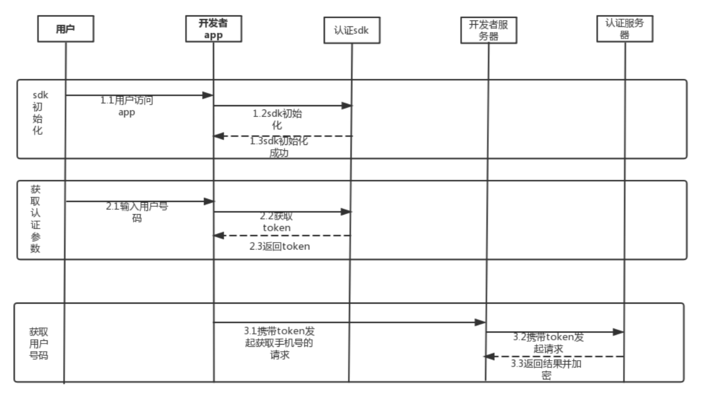

# 服务端接口

## 移动认证服务端接口

### 获取用户登录手机号码的接口

#### 简要描述

* 获取用户登录手机号码的接口

#### 请求URL

* [https://account.linkedme.cc/phone/info](https://account.linkedme.cc/phone/info)

#### 请求方式

* POST+json,Content-type设置为application/json 

#### 请求参数

<table>
  <thead>
    <tr>
      <th style="text-align:left">&#x53C2;&#x6570;&#x540D;</th>
      <th style="text-align:left">&#x5FC5;&#x9009;</th>
      <th style="text-align:left">&#x7C7B;&#x578B;</th>
      <th style="text-align:left">&#x8BF4;&#x660E;</th>
    </tr>
  </thead>
  <tbody>
    <tr>
      <td style="text-align:left">channel</td>
      <td style="text-align:left">&#x662F;</td>
      <td style="text-align:left">string</td>
      <td style="text-align:left">&#x8FD0;&#x8425;&#x5546;&#x7C7B;&#x578B;&#xFF1A; &#xFF08;0&#xFF1A;&#x79FB;&#x52A8;&#xFF09;&#xFF0C;&#xFF08;1&#xFF1A;&#x7535;&#x4FE1;&#xFF09;&#xFF0C;&#xFF08;2&#xFF1A;&#x8054;&#x901A;&#xFF09;</td>
    </tr>
    <tr>
      <td style="text-align:left">platform</td>
      <td style="text-align:left">&#x662F;</td>
      <td style="text-align:left">string</td>
      <td style="text-align:left">&#x5E73;&#x53F0;&#x7F16;&#x53F7;&#xFF1A; IOS (0, &quot;ios&quot;), ANDROID
        (1, &quot;android&quot;)</td>
    </tr>
    <tr>
      <td style="text-align:left">appId</td>
      <td style="text-align:left">&#x662F;</td>
      <td style="text-align:left">string</td>
      <td style="text-align:left">&#x5E94;&#x7528;ID</td>
    </tr>
    <tr>
      <td style="text-align:left">authCode</td>
      <td style="text-align:left">&#x5426;</td>
      <td style="text-align:left">string</td>
      <td style="text-align:left">&#x6821;&#x9A8C;&#x7801;&#xFF0C;&#x5F53;&#x8FD0;&#x8425;&#x5546;&#x7C7B;&#x578B;&#x4E3A;1&#x65F6;&#xFF0C;&#x5FC5;&#x586B;</td>
    </tr>
    <tr>
      <td style="text-align:left">token</td>
      <td style="text-align:left">&#x662F;</td>
      <td style="text-align:left">string</td>
      <td style="text-align:left">&#x8EAB;&#x4EFD;&#x6807;&#x8BC6;&#xFF0C;&#x83B7;&#x53D6;&#x7528;&#x6237;&#x4FE1;&#x606F;</td>
    </tr>
    <tr>
      <td style="text-align:left">sign</td>
      <td style="text-align:left">&#x662F;</td>
      <td style="text-align:left">string</td>
      <td style="text-align:left">
        <p>&#x9664;sign &#x5916;&#x5176;&#x5B83;&#x53C2;&#x6570;&#x7684; RSA &#x52A0;&#x5BC6;&#x503C;&#xFF0C;
          &#x52A0;&#x5BC6;&#x7B97;&#x6CD5;&#x5982;&#x4E0B;:</p>
        <p>sign=RSA(appId+authCode+channel+platform+sign+token,RSA_Private_key) &#x8F6C;16&#x8FDB;&#x5236;&#x3002;</p>
        <p>&#x7B7E;&#x540D;&#x7B97;&#x6CD5;&#x4E3A;&#xFF1A;SHA256withRSA&#x3002;</p>
        <p>&#x9700;&#x8981;&#x6CE8;&#x610F;&#x53C2;&#x6570;&#x62FC;&#x63A5; key&#x5347;&#x5E8F;&#x6392;&#x5E8F;&#xFF0C;&#x5BC6;&#x94A5;&#x683C;&#x5F0F;&#x4E3A;PSKCS#8&#xFF0C;1024&#x4F4D;&#xFF08;bit&#xFF09;&#x3002;</p>
        <p>&#x5176;&#x4E2D; RSA_Private_key&#x662F;&#x5408;&#x4F5C;&#x65B9;&#x7684;
          RSA &#x79C1;&#x94A5;&#xFF0C;&#x5408;&#x4F5C;&#x65B9;&#x9700;&#x8981;&#x5411;&#x5F00;&#x653E;&#x5E73;&#x53F0;&#x63D0;&#x4F9B;
          RSA &#x516C;&#x94A5;&#xFF0C;&#x7528;&#x4E8E;&#x8BBF;&#x95EE;&#x63A5;&#x53E3;&#x65F6;&#x7684;&#x9A8C;&#x7B7E;</p>
      </td>
    </tr>
  </tbody>
</table>#### 请求示例

```text
{
    "header": {
        "Content-type": application/json,
    },
    "body": {
       "channel":"1",
       "platform":"0",
       "app_id":"10230",
       "token":"nm899e6f8f32b44f81972cbe28ca01623a",
       "sign":"4B36329C1429512FD24C2C460065F677D3521EC56A91370AFF40E65990AF74C7D12C9F0E6061D2E2C6FE022B66CCD23554249ECA13D5F8FB0E8C7459DD6D25A0309FD6AE73D4918E45EAF85AB7D4DA942B3664966B92CEFC57B7B28CC4EE57186A1B27860FF74698FE6307A85F0DD9D3A13A34397CB8F4F921DC3869BAA9B80"
    }
}
```

#### 返回参数

<table>
  <thead>
    <tr>
      <th style="text-align:left">&#x53C2;&#x6570;&#x540D;</th>
      <th style="text-align:left">&#x5FC5;&#x9009;</th>
      <th style="text-align:left">&#x7C7B;&#x578B;</th>
      <th style="text-align:left">&#x8BF4;&#x660E;</th>
    </tr>
  </thead>
  <tbody>
    <tr>
      <td style="text-align:left">code</td>
      <td style="text-align:left">&#x662F;</td>
      <td style="text-align:left">int</td>
      <td style="text-align:left">&#x8FD4;&#x56DE;&#x72B6;&#x6001;&#x7801;</td>
    </tr>
    <tr>
      <td style="text-align:left">msg</td>
      <td style="text-align:left">&#x662F;</td>
      <td style="text-align:left">string</td>
      <td style="text-align:left">&#x8FD4;&#x56DE;&#x72B6;&#x6001;&#x7801;&#x63CF;&#x8FF0;&#x4FE1;&#x606F;</td>
    </tr>
    <tr>
      <td style="text-align:left">time</td>
      <td style="text-align:left">&#x662F;</td>
      <td style="text-align:left">long</td>
      <td style="text-align:left">&#x8BF7;&#x6C42;&#x6D88;&#x606F;&#x53D1;&#x9001;&#x7684;&#x7CFB;&#x7EDF;&#x65F6;&#x95F4;&#x7684;&#x6BEB;&#x79D2;&#x503C;</td>
    </tr>
    <tr>
      <td style="text-align:left">body</td>
      <td style="text-align:left">&#x662F;</td>
      <td style="text-align:left">string</td>
      <td style="text-align:left">
        <p>&#x8FD4;&#x56DE;&#x4F53;&#xFF0C;&#x8868;&#x793A;&#x624B;&#x673A;&#x53F7;&#x7801;&#xFF0C;&#x52A0;&#x5BC6;&#x65B9;&#x5F0F;&#x4E3A;RSA&#xFF0C;</p>
        <p>&#x5F00;&#x53D1;&#x8005;&#x4F7F;&#x7528;&#x5728;&#x793E;&#x533A;&#x914D;&#x7F6E;&#x7684;&#x52A0;&#x5BC6;&#x516C;&#x94A5;&#x5BF9;&#x5E94;&#x7684;&#x79C1;&#x94A5;&#x8FDB;&#x884C;&#x89E3;&#x5BC6;&#xFF0C;</p>
        <p>&#x5BC6;&#x94A5;&#x683C;&#x5F0F;&#x4E3A;PSKCS#8&#xFF0C;&#x751F;&#x6210;&#x5BC6;&#x94A5;&#x4F4D;&#x6570;&#x4E3A;1024&#x4F4D;&#xFF08;bit&#xFF09;&#xFF0C;body&#x4E3A;16&#x8FDB;&#x5236;&#x5B57;&#x7B26;&#x4E32;&#x3002;</p>
      </td>
    </tr>
  </tbody>
</table>#### 返回示例

```text
{
      "header": {
        "code": 200,
        "msg": "操作成功",
        "time": 1561690611021
                 },
      "body": "4B36329C1429512FD24C2C460065F677D3521EC56A91370AFF40E65990AF74C7D12C9F0E6061D2E2C6FE022B66CCD23554249ECA13D5F8FB0E8C7459DD6D25A0309FD6AE73D4918E45EAF85AB7D4DA942B3664966B92CEFC57B7B28CC4EE57186A1B27860FF74698FE6307A85F0DD9D3A13A34397CB8F4F921DC3869BAA9B80"
}
```

#### 时序图



### 校验用户登录号码接口

#### 简要描述

* 校验用户登录号码接口

#### 请求URL

* [https://account.linkedme.cc/phone/verify](https://account.linkedme.cc/phone/verify)

#### 请求方式

* POST+json,Content-type设置为application/json 

#### 请求参数

<table>
  <thead>
    <tr>
      <th style="text-align:left">&#x53C2;&#x6570;&#x540D;</th>
      <th style="text-align:left">&#x5FC5;&#x9009;</th>
      <th style="text-align:left">&#x7C7B;&#x578B;</th>
      <th style="text-align:left">&#x8BF4;&#x660E;</th>
    </tr>
  </thead>
  <tbody>
    <tr>
      <td style="text-align:left">channel</td>
      <td style="text-align:left">&#x662F;</td>
      <td style="text-align:left">string</td>
      <td style="text-align:left">&#x8FD0;&#x8425;&#x5546;&#x7C7B;&#x578B;&#xFF1A; &#xFF08;0&#xFF1A;&#x79FB;&#x52A8;&#xFF09;&#xFF0C;&#xFF08;1&#xFF1A;&#x7535;&#x4FE1;&#xFF09;&#xFF0C;&#xFF08;2&#xFF1A;&#x8054;&#x901A;&#xFF09;</td>
    </tr>
    <tr>
      <td style="text-align:left">platform</td>
      <td style="text-align:left">&#x662F;</td>
      <td style="text-align:left">string</td>
      <td style="text-align:left">&#x5E73;&#x53F0; IOS (0, &quot;ios&quot;), ANDROID (1, &quot;android&quot;)</td>
    </tr>
    <tr>
      <td style="text-align:left">appId</td>
      <td style="text-align:left">&#x662F;</td>
      <td style="text-align:left">string</td>
      <td style="text-align:left">&#x5E94;&#x7528;ID</td>
    </tr>
    <tr>
      <td style="text-align:left">token</td>
      <td style="text-align:left">&#x662F;</td>
      <td style="text-align:left">string</td>
      <td style="text-align:left">&#x8EAB;&#x4EFD;&#x6807;&#x8BC6;&#xFF0C;&#x83B7;&#x53D6;&#x7528;&#x6237;&#x4FE1;&#x606F;</td>
    </tr>
    <tr>
      <td style="text-align:left">phoneNum</td>
      <td style="text-align:left">&#x662F;</td>
      <td style="text-align:left">string</td>
      <td style="text-align:left">&#x624B;&#x673A;&#x53F7;</td>
    </tr>
    <tr>
      <td style="text-align:left">sign</td>
      <td style="text-align:left">&#x662F;</td>
      <td style="text-align:left">string</td>
      <td style="text-align:left">
        <p>&#x9664; sign &#x5916;&#x5176;&#x5B83;&#x53C2;&#x6570;&#x7684; RSA &#x52A0;&#x5BC6;&#x503C;&#xFF0C;&#x52A0;&#x5BC6;&#x7B97;&#x6CD5;&#x5982;&#x4E0B;:</p>
        <p>sign=RSA(appId+channel+phoneNum+platform+sign+token,RSA_Private_key)&#x8F6C;16&#x8FDB;&#x5236;&#x3002;</p>
        <p>&#x7B7E;&#x540D;&#x7B97;&#x6CD5;&#x4E3A;&#xFF1A;SHA256withRSA, 1024&#x4F4D;&#xFF08;bit&#xFF09;&#x3002;</p>
        <p>&#x9700;&#x8981;&#x6CE8;&#x610F;&#x53C2;&#x6570;&#x62FC;&#x63A5; key &#x5347;&#x5E8F;&#x6392;&#x5E8F;,&#x5BC6;&#x94A5;&#x683C;&#x5F0F;&#x4E3A;PSKCS#8&#x3002;</p>
        <p>&#x5176;&#x4E2D; RSA_Private_key &#x662F;&#x5408;&#x4F5C;&#x65B9;&#x7684;
          RSA &#x79C1;&#x94A5;&#xFF0C;&#x5408;&#x4F5C;&#x65B9;&#x9700;&#x8981;&#x5411;&#x5F00;&#x653E;&#x5E73;&#x53F0;&#x63D0;&#x4F9B;RSA&#x516C;&#x94A5;&#xFF0C;&#x7528;&#x4E8E;&#x8BBF;&#x95EE;&#x63A5;&#x53E3;&#x65F6;&#x7684;&#x9A8C;&#x7B7E;</p>
      </td>
    </tr>
  </tbody>
</table>#### 请求示例

```text
{
    "header": {
        "Content-type": application/json,
    },
    "body": {
       "channel":"1",
       "platform":"0",
       "app_id":"10230",
       "token":"nm899e6f8f32b44f81972cbe28ca01623a",
       "phone_num":"18123972798",                                        
       "sign":"4B36329C1429512FD24C2C460065F677D3521EC56A91370AFF40E65990AF74C7D12C9F0E6061D2E2C6FE022B66CCD23554249ECA13D5F8FB0E8C7459DD6D25A0309FD6AE73D4918E45EAF85AB7D4DA942B3664966B92CEFC57B7B28CC4EE57186A1B27860FF74698FE6307A85F0DD9D3A13A34397CB8F4F921DC3869BAA9B80"
    }
}
```

#### 返回参数

<table>
  <thead>
    <tr>
      <th style="text-align:left">&#x53C2;&#x6570;&#x540D;</th>
      <th style="text-align:left">&#x5FC5;&#x9009;</th>
      <th style="text-align:left">&#x7C7B;&#x578B;</th>
      <th style="text-align:left">&#x8BF4;&#x660E;</th>
    </tr>
  </thead>
  <tbody>
    <tr>
      <td style="text-align:left">code</td>
      <td style="text-align:left">&#x662F;</td>
      <td style="text-align:left">int</td>
      <td style="text-align:left">&#x8FD4;&#x56DE;&#x72B6;&#x6001;&#x7801;</td>
    </tr>
    <tr>
      <td style="text-align:left">msg</td>
      <td style="text-align:left">&#x662F;</td>
      <td style="text-align:left">string</td>
      <td style="text-align:left">&#x8FD4;&#x56DE;&#x72B6;&#x6001;&#x7801;&#x63CF;&#x8FF0;&#x4FE1;&#x606F;</td>
    </tr>
    <tr>
      <td style="text-align:left">time</td>
      <td style="text-align:left">&#x662F;</td>
      <td style="text-align:left">long</td>
      <td style="text-align:left">&#x8BF7;&#x6C42;&#x6D88;&#x606F;&#x53D1;&#x9001;&#x7684;&#x7CFB;&#x7EDF;&#x65F6;&#x95F4;&#x7684;&#x6BEB;&#x79D2;&#x503C;</td>
    </tr>
    <tr>
      <td style="text-align:left">body</td>
      <td style="text-align:left">&#x662F;</td>
      <td style="text-align:left">string</td>
      <td style="text-align:left">
        <p>&#x8FD4;&#x56DE;&#x4F53;&#xFF0C;&#x8868;&#x793A;&#x6821;&#x9A8C;&#x7ED3;&#x679C;&#xFF08;true/false&#xFF09;&#xFF0C;&#x52A0;&#x5BC6;&#x65B9;&#x5F0F;&#x4E3A;RSA&#xFF0C;</p>
        <p>&#x5F00;&#x53D1;&#x8005;&#x4F7F;&#x7528;&#x5728;&#x793E;&#x533A;&#x914D;&#x7F6E;&#x7684;&#x52A0;&#x5BC6;&#x516C;&#x94A5;&#x5BF9;&#x5E94;&#x7684;&#x79C1;&#x94A5;&#x8FDB;&#x884C;&#x89E3;&#x5BC6;&#xFF0C;</p>
        <p>&#x5BC6;&#x94A5;&#x683C;&#x5F0F;&#x4E3A;PSKCS#8&#xFF0C;&#x751F;&#x6210;&#x5BC6;&#x94A5;&#x4F4D;&#x6570;&#x4E3A;1024&#x4F4D;&#xFF08;bit&#xFF09;&#xFF0C;body&#x4E3A;16&#x8FDB;&#x5236;&#x5B57;&#x7B26;&#x4E32;&#x3002;</p>
      </td>
    </tr>
  </tbody>
</table>#### 返回示例

```text
{
      "header": {
         "code": 200,
         "msg": "操作成功",
         "time": 1561690611021
                 },
      "body": "4B36329C1429512FD24C2C460065F677D3521EC56A91370AFF40E65990AF74C7D12C9F0E6061D2E2C6FE022B66CCD23554249ECA13D5F8FB0E8C7459DD6D25A0309FD6AE73D4918E45EAF85AB7D4DA942B3664966B92CEFC57B7B28CC4EE57186A1B27860FF74698FE6307A85F0DD9D3A13A34397CB8F4F921DC3869BAA9B80"
}
```

#### 时序图


### 平台返回码说明

| 返回码 | 返回描述信息 |
| :--- | :--- |
| 900001 | 解密运营商返回结果错误 |
| 900002 | 加签运营商请求错误 |
| 900003 | xxtea加密请求参数错误 |
| 900004 | 运营商参数3DesAndBase64加密错误 |
| 900005 | channel来源渠道参数错误 |
| 900006 | platform平台类型参数错误 |
| 900007 | authCode校验码参数错误 |
| 900008 | 手机号格式不正确 |
| 900009 | appId错误 |
| 900010 | token参数错误 |
| 900011 | 验签失败 |
| 900012 | token失效 |
| 900013 | 权限不足 |
| 900014 | 应用未授权 |
| 900015 | 参数异常 |
| 900016 | ip白名单校验失败 |
| 900017 | 加密失败 |
| 900018 | 无法获取手机号 |
| 900019 | 次数不足 |
| 900020 | 内部错误 |

