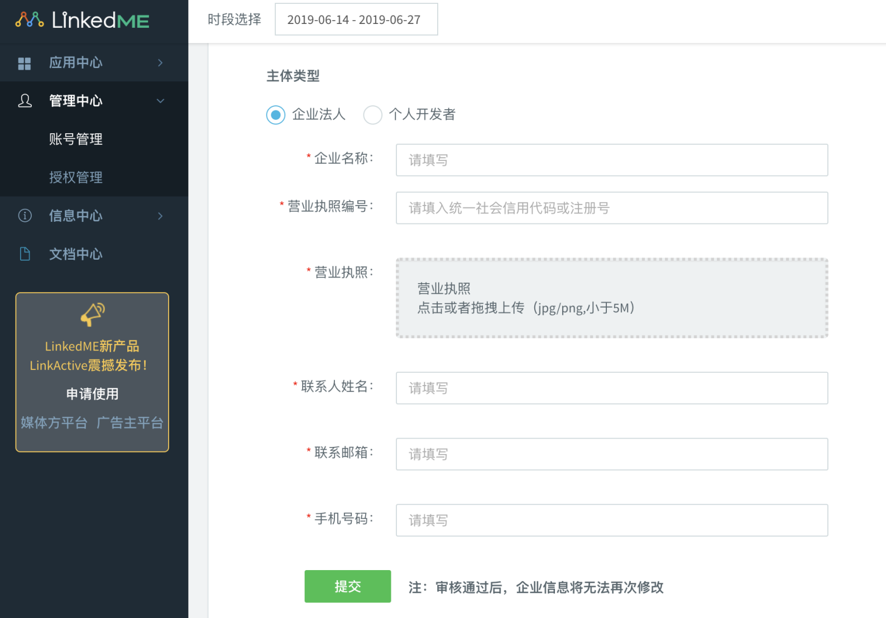
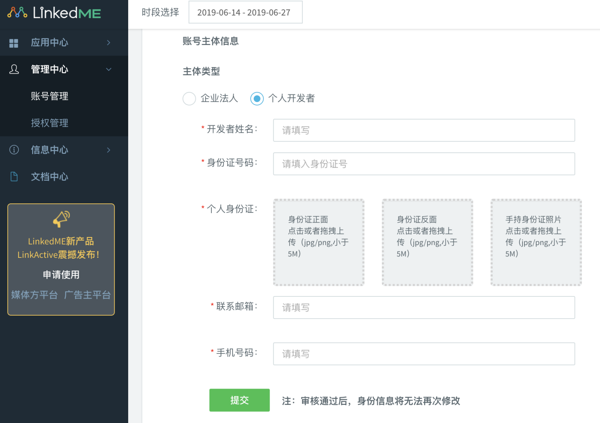
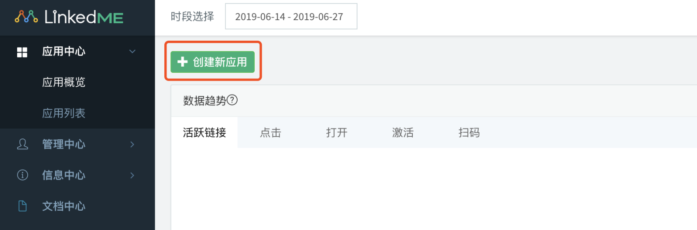
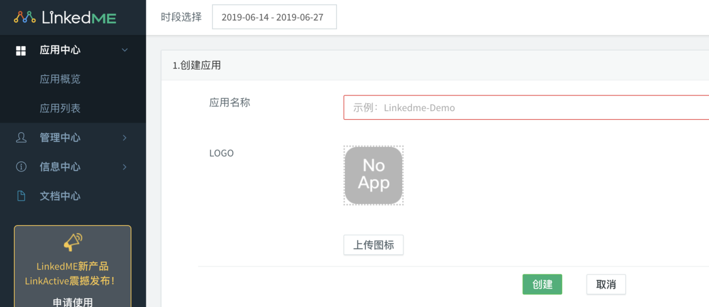
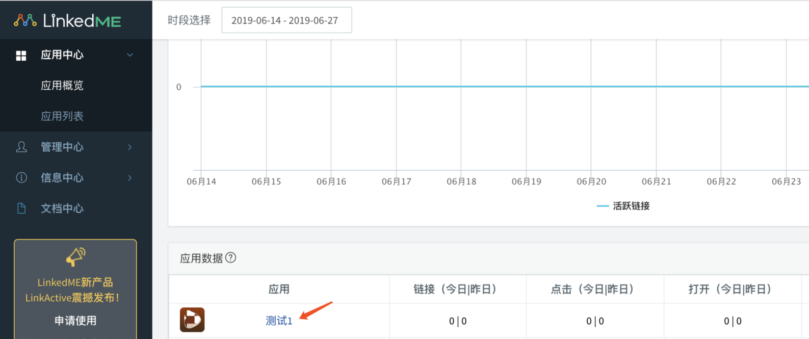
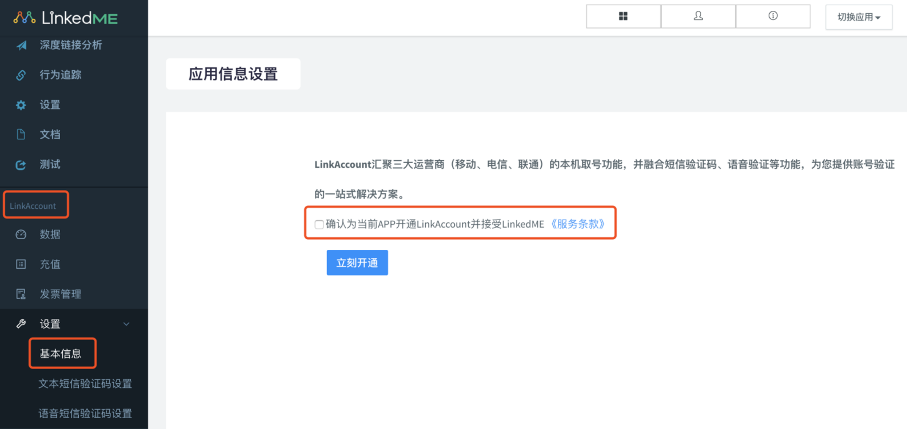
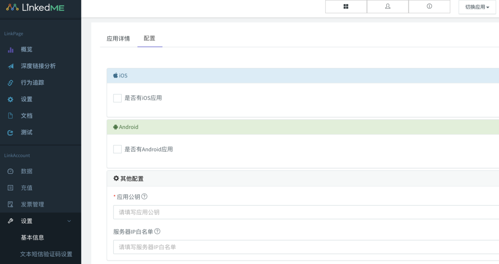

# 后台使用指南

### 开发者认证

若要使用LinkAccount产品，请先完成企业资质认证或者个人实名认证

登录开发者后台，选择管理中心-账号管理-账号认证，完成开发者认证。

#### 企业资质认证

#### 个人资质认证

### 创建应用

开发者后台点击创建新应用，填写应用名称并上传logo，完成应用创建

### LinkAccount使用

从控制台首页，点击创建的应用名称进入该应用后台

通过左侧LinkAccount 区块部分，设置-基本信息页面进入该APP的LinkAccount开通界面，勾选服务条款，并立即开通

#### 应用配置

根据需求配置iOS和Android应用、服务端的信息，其中：

* iOS需要配置Bundle ID
* Android需要配置Package Name及签名
* 服务端验签及加密的公钥、服务器IP白名单

#### 查看应用APPID和APPKEY

在设置-基本信息-应用详情页面可以查看应用APPID和APPKEY

