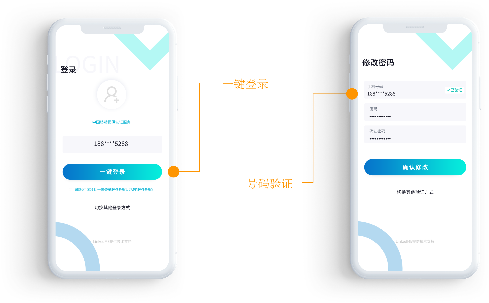

# 产品介绍

### LinkAccount是什么？

一种更新颖、更安全、更便捷的用户认证方式。  
 直连三大运营商网关取号，全程加密，实现注册、登录一键搞定！   
调用网关鉴权，1S即校验用户身份，识别精准，安全可靠。   
帮助企业优化验证流程，助力运营拉新、留存、促活。

### 介绍图

### 应用场景

* 注册
* 登录
* 账号认证

### 产品优势

* 一键取号转化高，提升拉新率，节省拉新成本 应用拉新转化率提升35%
* 免密登录体验佳 登录时长，降低30秒
* 机卡校验安全好 业务安全校验，防止权益被薅

