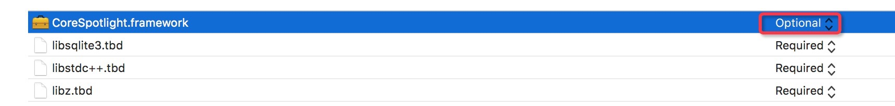
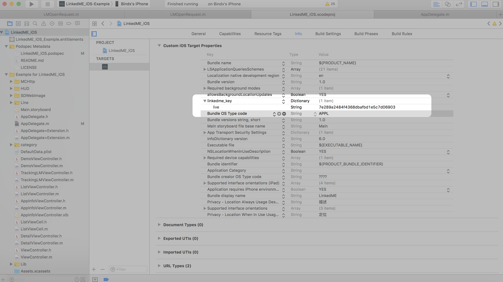
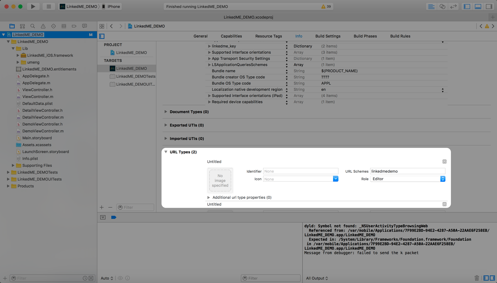
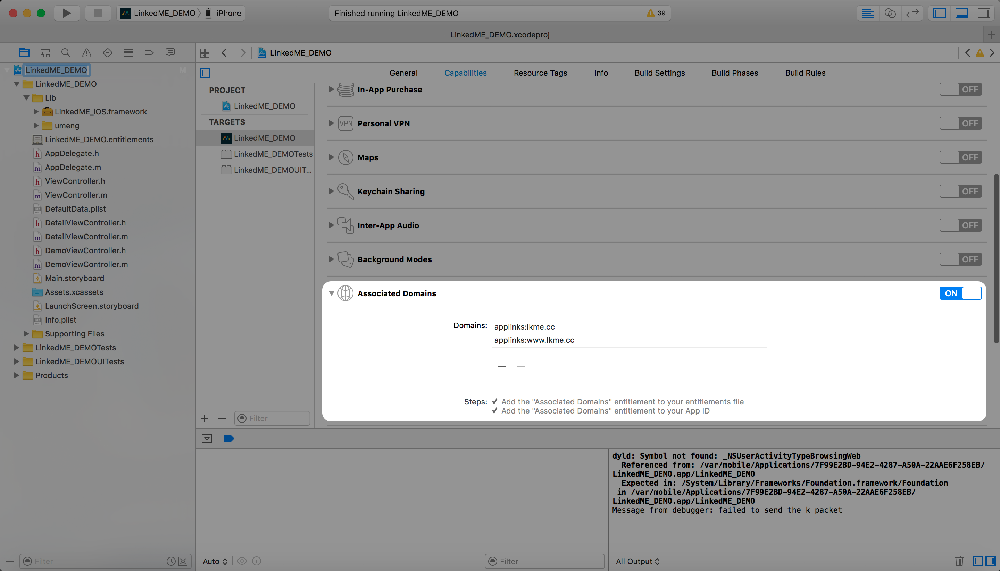

# iOS SDK

## 准备工作

### 获取LinkedME Key

新用户：在官网网站[注册账号](https://www.linkedme.cc/dashboard/index.html#/access/signup)，注册后[创建应用](https://www.linkedme.cc/dashboard/index.html#/app/aplt/create)，在后台导航栏“设置”中查看LinkedME Key。

老用户：已经在官网网站注册账号，直接[创建应用](https://www.linkedme.cc/dashboard/index.html#/app/aplt/create)（可以创建多个应用），直接到导航栏“设置”中查看LinkedME Key。


### 获取LinkedME iOS SDK及Demo

到官方网站下载LinkedME-iOS-Deep-Linking-SDK，下载[Demo工程](https://github.com/WFC-LinkedME/LinkedME-iOS-Deep-Linking-Demo)

## 导入SDK

您可以直接导入下载的SDK或通过Cocoapods安装SDK

### 直接导入LinkedME iOS SDK

把Demo工程中的LinkedME\_iOS.framework，导入工程中。

```text
CoreSpotlight.framework (status:Optional)
SystemConfiguration.framework
Security.framework
WebKit.framework
StoreKit.framework
```

注意事项：CoreSpotlight.framework必须标记为可选。

### 通过Cocoapods安装SDK

如果您想更方便地集成/更新 LinkPage的SDK，可以使用Cocoapods工具，想要了解Cocoapods，推荐参考官方文档[《CocoaPods安装和使用教程》](http://code4app.com/article/cocoapods-install-usage)。

* 编辑Podfile文件并添加以下代码                          

  ```text
  pod 'LinkedME_LinkPage'
  ```

* 运行 pod install
* 从现在开始使用 .xcworkspace 打开项目，而不是 .xcodeproj

> 提示：如果提示\[!\] Unable to find a pod with name, author, summary, or description matching \` LinkedME\_LinkPage\`
>
> 解决方法就是Finder前往资源库去删除缓存中的search\_index.json
>
> 执行：rm -rf ~/Library/Caches/CocoaPods/search\_index.json 再重新search/install/update

## 基本配置

### 添加系统Framework

* CoreSpotlight.framework\(status:Optional\)
* SystemConfiguration.framework
* Security.framework  
* WebKit.framework
* StoreKit.framework

注意：CoreSpotlight.framework必须标记为可选。



### 配置linkedme\_key

* 打开info.plist文件
* 在列表中点击右键选择add row添加一个分组
* 创建一个新的item名称为linkedme\_key，类型为Dictionary
* 在linkedme\_key新增一个字符串类型的item，live字段，到后台“设置”-&gt;“应用”中进行查看



### 配置URL Scheme

配置URL Scheme，以便通过URL Scheme来唤起APP

* 打开info.plist
* 找到URL Types（如果没有就右键add row添加一个）
* 添加"you app"\(你的app的唯一标识字符串\)



### 配置Universal Link支持 \(仅支持iOS 9\)

配置Universal Link，使得iOS9中可以通过Universal Link来唤起APP

* 在左侧导航器中点击您的项目
* 选择'Capabilities'标签
* 打开'Associated Domains'开关
* 添加applinks:lkme.cc和applinks:www.lkme.cc



### 添加URLScheme和Universal Link支持

在SDK中配置URL Scheme和Universal Link，使得可以通过URL Scheme和Universal Link唤起APP 在Appdelegate中实现下列方法：

* \(BOOL\)application:\(UIApplication_\)application openURL:\(NSURL_\)url sourceApplication:\(NSString\*\)sourceApplication annotation:\(id\)annotation{ //判断是否是通过LinkedME的UrlScheme唤起App if \(\[\[url description\] rangeOfString:@"click\_id"\].location != NSNotFound\) { return \[\[LinkedME getInstance\] handleDeepLink:url\]; }

  return YES; }

//Universal Links 通用链接实现深度链接技术

* \(BOOL\)application:\(UIApplication_\)application continueUserActivity:\(NSUserActivity_\)userActivity restorationHandler:\(void \(^\)\(NSArray\*\)\)restorationHandler{

  //判断是否是通过LinkedME的Universal Links唤起App if \(\[\[userActivity.webpageURL description\] rangeOfString:@"lkme.cc"\].location != NSNotFound\) { return \[\[LinkedME getInstance\] continueUserActivity:userActivity\]; } return YES; }

//URI Scheme 实现深度链接技术

* \(BOOL\)application:\(UIApplication _\)app openURL:\(NSURL_ \)url options:\(NSDictionary \*\)options{ NSLog\(@"opened app from URL %@", \[url description\]\);

  //判断是否是通过LinkedME的UrlScheme唤起App if \(\[\[url description\] rangeOfString:@"click\_id"\].location != NSNotFound\) { return \[\[LinkedME getInstance\] handleDeepLink:url\]; } return YES; }

  //URI Scheme 实现深度链接技术 func application\(application: UIApplication, openURL url: NSURL, sourceApplication: String?, annotation: AnyObject\) -&gt; Bool { //判断是否是通过LinkedME的UrlScheme唤起App if url.absoluteString.componentsSeparatedByString\("click\_id"\).count &gt; 1 { return LinkedME.getInstance\(\).handleDeepLink\(url\); } }

//Universal Links 通用链接实现深度链接技术 func application\(\_ application: UIApplication, continue userActivity: NSUserActivity, restorationHandler: @escaping \(\[UIUserActivityRestoring\]?\) -&gt; Void\) -&gt; Bool { //判断是否是通过LinkedME的Universal Links唤起App if url.absoluteString.componentsSeparatedByString\("lkme.cc"\).count &gt; 1 { return LinkedME.getInstance\(\).continueUserActivity\(userActivity\); } }

//URI Scheme 实现深度链接技术 func application\(app: UIApplication, openURL url: NSURL, options: \[String : AnyObject\]\) -&gt; Bool { //判断是否是通过LinkedME的UrlScheme唤起App if url.absoluteString.componentsSeparatedByString\("click\_id"\).count &gt; 1 { return LinkedME.getInstance\(\).handleDeepLink\(url\); } }

## 深度链接功能

本模块实现的功能是创建深度链接及通过深度链接跳转到APP内的详情页面，若想要使用如下功能，请务必将“基本配置”部分全部实现

### 创建深度链接

温馨提示：如果web端集成了web sdk，则无需客户端创建深度链接，本节无需集成。  
通过SDK创建深度链接，例如在分享页面时，页面的链接是通过SDK生成的深度链接，当打开分享内容时就可以通过深度链接唤起APP并进入对应页面

```java
//创建短链
-(void)addPara{
  self.linkedUniversalObject = [[LMUniversalObject alloc] init];
  self.linkedUniversalObject.title = title;//标题
  LMLinkProperties *linkProperties = [[LMLinkProperties alloc] init];
  linkProperties.channel = @"";//渠道(微信,微博,QQ,等...)
  linkProperties.feature = @"Share";//特点
  linkProperties.tags=@[@"LinkedME",@"Demo"];//标签
  linkProperties.stage = @"Live";//阶段
  [linkProperties addControlParam:@"View" withValue:arr[page][@"url"]];//自定义参数，用于在深度链接跳转后获取该数据，这里代表页面唯一标识
  [linkProperties addControlParam:@"LinkedME" withValue:@"Demo"];//自定义参数，用于在深度链接跳转后获取该数据，这里标识是Demo 
  //开始请求短链
  [self.linkedUniversalObject getShortUrlWithLinkProperties:linkProperties andCallback:^(NSString *url, NSError *err) {
    if (url) {
      NSLog(@"[LinkedME Info] SDK creates the url is:%@", url);
      //拼接连接
      [H5_LIVE_URL stringByAppendingString:arr[page][@"form"]];
      [H5_LIVE_URL stringByAppendingString:@"?linkedme="];
      H5_LIVE_URL = [NSString stringWithFormat:@"https://www.linkedme.cc/h5/%@?linkedme=",arr[page][@"form"]];
      //前面是Html5页面,后面拼上深度链接https://xxxxx.xxx (html5 页面地址) ?linkedme=(深度链接)
      //https://www.linkedme.cc/h5/feature?linkedme=https://lkme.cc/AfC/mj9H87tk7
      LINKEDME_SHORT_URL = [H5_LIVE_URL stringByAppendingString:url];      
    } else {
      LINKEDME_SHORT_URL = H5_LIVE_URL;
    }
  }];
}
```

| 参数名称 | 含义 | 功能 |
| :--- | :--- | :--- |
| Channel | 渠道 | 表示深度链接的渠道，方便统计分析和追踪，例如微信、微博，百度等等； |
| Feature | 特点 | 表示深度链接的特点，例如邀请，分享等等； |
| Tags | 标签 | 表示深度链接的标签特性，自定义任何值； |
| Stage | 阶段 | 表示深度链接的阶段特性，比如第一版产品发布，第二版本测试等等； |

### 解析深度链接

通过深度链接唤起APP时，解析深度链接携带的参数以打开对应页面

#### 配置AppDelegate

Objective-C请先进行如下配置： 1. 在AppDelegate中引入头文件`#import <LinkedME_iOS/LinkedME.h>` 2. 在Appdelegate里注册ViewController

Swift请先进行如下配置：  
1. 在xxxx-Bridging-Header.h中导入头文件`#import <LinkedME_iOS/LinkedME.h>` 2. 在Appdelegate里注册ViewController

#### 配置注册ViewController设置及跳转方式

* \(BOOL\)application:\(UIApplication _\)application didFinishLaunchingWithOptions:\(NSDictionary_ \)launchOptions {

  // Override point for customization after application launch.'

  //初始化及实例

  LinkedME\* linkedme = \[LinkedME getInstance\];

// //注册需要跳转的viewController UIStoryboard  _storyBoard=\[UIStoryboard storyboardWithName:@"Main" bundle:\[NSBundle mainBundle\]\]; DetailViewController_ dvc=\[storyBoard instantiateViewControllerWithIdentifier:@"detailView"\];

//\[自动跳转\]如果使用自动跳转需要注册viewController // \[linkedme registerDeepLinkController:featureVC forKey:@"LMFeatureViewController"\];

//获取跳转参数 \[linkedme initSessionWithLaunchOptions:launchOptions automaticallyDisplayDeepLinkController:NO deepLinkHandler:^\(NSDictionary _params, NSError_ error\) { if \(!error\) { //防止传递参数出错取不到数据,导致App崩溃这里一定要用try catch @try { NSLog\(@"LinkedME finished init with params = %@",\[params description\]\); //获取标题 NSString _title = \[params objectForKey:@"$og\_title"\]; NSString_ tag = params\[@"$control"\]\[@"View"\];

```text
  if (title.length >0 && tag.length >0) {
```

//如果app需要登录或者注册后，才能打开详情页，这里可以先把值存起来，登录/注册完成后，再使用 //\[自动跳转\]使用自动跳转 //SDK提供的跳转方法 /\*\*

* pushViewController : 类名
* storyBoardID : 需要跳转的页面的storyBoardID
* animated : 是否开启动画
* customValue : 传参  __warning 需要在被跳转页中实现次方法 - \(void\)configureControlWithData:\(NSDictionary _\)data;_ /

  // \[LinkedME pushViewController:title storyBoardID:@"detailView" animated:YES customValue:@{@"tag":tag} completion:^{ //// // }\];

  //自定义跳转 dvc.openUrl = params\[@"$control"\]\[@"ViewId"\]; \[\[LinkedME getViewController\] showViewController:dvc sender:nil\]; } } @catch \(NSException \*exception\) {

  } @finally { } } else { NSLog\(@"LinkedME failed init: %@", error\); } }\]; return YES; }

func application\(application: UIApplication, didFinishLaunchingWithOptions launchOptions: \[NSObject: AnyObject\]?\) -&gt; Bool { // Override point for customization after application launch. let linkedme = LinkedME.getInstance\(\);

//是否开启Debug模式,开启Debug模式将会打印日志,上线时请关闭Debug模式 //linkedme.setDebug\(\);

let storyBoard = UIStoryboard\(\).instantiateViewControllerWithIdentifier\("detailView"\); linkedme.registerDeepLinkController\(storyBoard, forKey: "detailView"\);

//解析深度链获取跳转参数，开发者自己实现参数相对应的页面内容。 linkedme.initSessionWithLaunchOptions\(launchOptions, automaticallyDisplayDeepLinkController: false\) { \(params, error\) in if\(error == nil\){ print\("LinkedME finished init with params\(params.description\)"\); let title = params\["$og\_title"\]; //如一个电商类的App通过商品ID来判断和区分改进入哪个详情页 let goodsID = params\["$control"\]!\["goodsID"\];

```text
   if (title!.isEqualToString("DetailViewController")){
   //页面跳转,使用自动跳转方式必须在被跳转的页面中实现代理方法传值,通过customValue传一个字典
   LinkedME.pushViewController("这里填写需要跳转的类名" as! String, storyBoardID: "这里填写StoryBoardID", animated: true, customValue: goodsID as! [AnyObject], completion: {});
  /*
   * 注:如果不是使用StoryBoard创建的View使用下面的方法进行跳转,更多方法进入LinkedME.h中查看
   * + (void)pushViewController:(NSString *)vc animated: (BOOL)flag customValue:(NSDictionary *)dict completion:(void (^)(void))completion NS_AVAILABLE_IOS(5_0);
   * 或者自己获取xxx.navigationController跳转页面,使用属性传值,如果没有使用自动跳转方法就不用注册View和实现代理方法.
   */
  }
}else{
   print(error);
}
```

} return true

## 其他功能

### Debug模式

在Debug模式下会打印日志

\[linkedme setDebug\];

linkedme.setDebug\(\);

### 测试模式

若想测试集成SDK后是否能正确生成并解析深度链接，可以使用测试模式。测试模式需要先在后台中注册您的测试设备，测试设备产生的数据将进入测试系统（Test）中。

* 在后台\(Dashboard\)中-设置-测试-添加测试设备

OC：通过`[LinkedME getTestID]`获取设备ID,去后台中添加设备

Swift：通过`LinkedME.getTestID()`获取设备ID,去后台中添加设备

### Spotlight 索引

配置Spotlight索引后，可以在iPhone的系统级搜索（主屏下拉或下拉菜单中的搜索）中搜索内容并直接打开APP的特定页面

#### 创建Spotlight索引

\[\[LinkedME getInstance\] createDiscoverableContentWithTitle:@"LinkedME 国内第一家企业级深度链接" description:@"让APP不再是信息孤岛!" thumbnailUrl:\[NSURL URLWithString:@"[http://7xq8b0.com1.z0.glb.clouddn.com/logo.png](http://7xq8b0.com1.z0.glb.clouddn.com/logo.png)"\] linkParams:dict type:@"" publiclyIndexable:NO keywords:set5 expirationDate:nil spotlightIdentifier:@"bbcc" spotlightCallback:^\(NSString _url, NSString_ spotlightIdentifier, NSError \*error\) {

```text
        }];
```

LinkedME.getInstance\(\).createDiscoverableContentWithTitle\("LinkedME 国内第一家企业级深度链接", description: "让APP不再是信息孤岛!", thumbnailUrl: NSURL.init\(string: "[http://7xq8b0.com1.z0.glb.clouddn.com/logo.png](http://7xq8b0.com1.z0.glb.clouddn.com/logo.png)"\), linkParams: dic, type: nil, publiclyIndexable: false, keywords: keyWord as NSSet as Set, expirationDate: nil, spotlightIdentifier: "linkedme"\) { \(url, spotlightID, error\) in }

**设置关键字**

NSSet \*keyWord = \[NSSet setWithObjects:@"linkedme", nil\];

let keyWord = NSSet.init\(array: \["linkedme","hellolkm"\]\)

**需要传递的参数**

NSSet \*set5 = \[NSSet setWithObjects:@"linkedme",@"linked",@"深度链接", nil\];

let dic = \["url":"[http://linkedme.cc](http://linkedme.cc)"\]

**关键字详解**

| title | 标题 |
| :--- | :--- |
| description | 描述 |
| publiclyIndexable | 是否公开 |
| type | 类型 |
| thumbnailUrl | 缩略图Url |
| keywords | 关键字 |
| userInfo | 用户详情 |
| expirationDate | 失效日期,设置失效日期会自动删除索引 |
| identifier | 标志符 |
| callback | 回调 |
| spotlightCallback | Spotlight回调 |

#### 删除索引

**删除所有索引**

\[LinkedME removeAllSearchItems\];

LinkedME.removeAllSearchItems\(\);

**通过spotlightIdentifier删除索引**

\[LinkedME removeSearchItemWith:@\[@"linkedme"\]\];

LinkedME.removeSearchItemWith\(\["linkedme"\]\);

