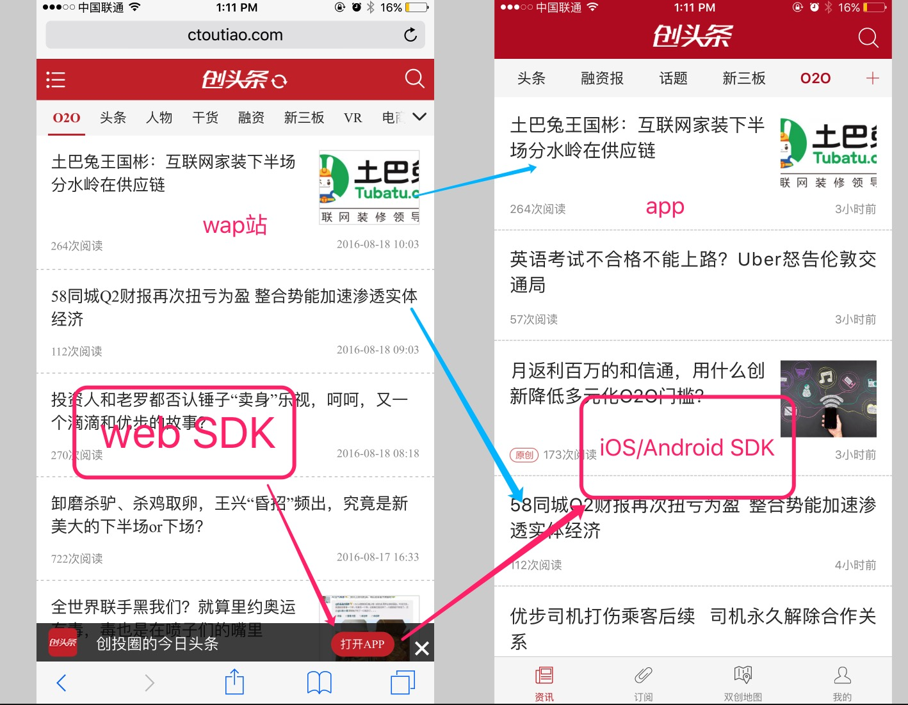
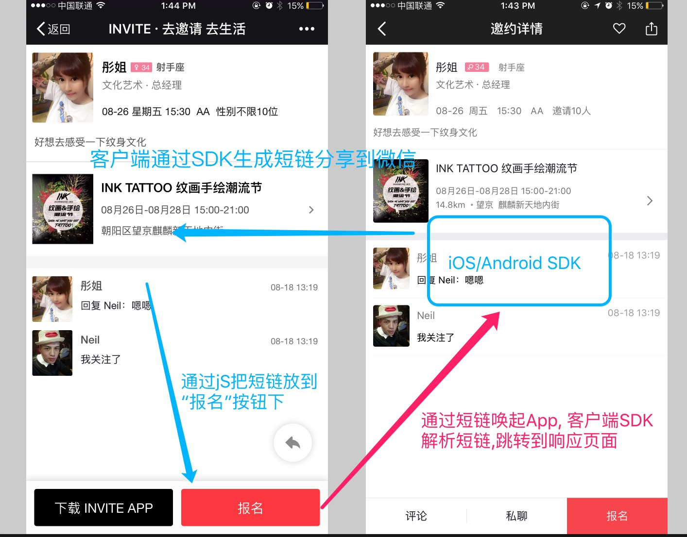
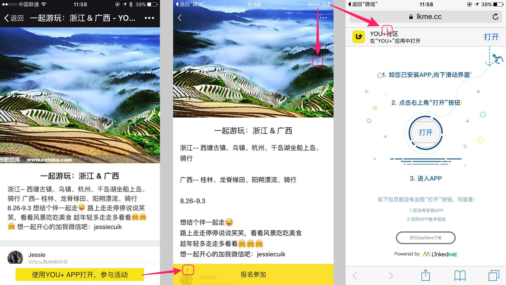

# LinkPage SDK下载

LinkPage SDK包括 Android/iOS SDK 和 JS SDK 两种，各 SDK 的下载及更新日志：

[iOS SDK下载及更新日志](ios-sdk-download.md)

[Android SDK下载及更新日志](android-sdk-download.md)

[JS SDK下载及更新日志](js-sdk-download.md)

## 我该如何选择SDK？

创建深度链接可以通过JS SDK来创建，也可以通过原生的Android/iOS SDK来创建，解析深度链接只能通过原生的Android/iOS SDK来解析。如下所示：

| 创建深度链接 | 解析深度链接 |
| :--- | :--- |
| JS SDK | Android SDK / iOS SDK |
| Android SDK / iOS SDK |  |

JS SDK创建深度链接的方式相较于Android/iOS SDK来说，使用方式更加灵活，所以我们推荐您使用JS SDK创建深度链接，那么什么样的情况用JS SDK创建深度链接更合适？

* 有自己的wap站同时有自己的APP并且wap站和APP的所有页面都是一一对应的，一般如新闻资讯类、电商类、直播类等，这种方式的APP我们建议使用JS SDK创建深度链接，客户端仅用于解析深度链接。  

  比如如下的形式

* 如果没有wap站，推荐采用Android/iOS SDK的方式创建深度链接，再通过js把深度链接放到打开按钮下。  

  比如如下形式

 

